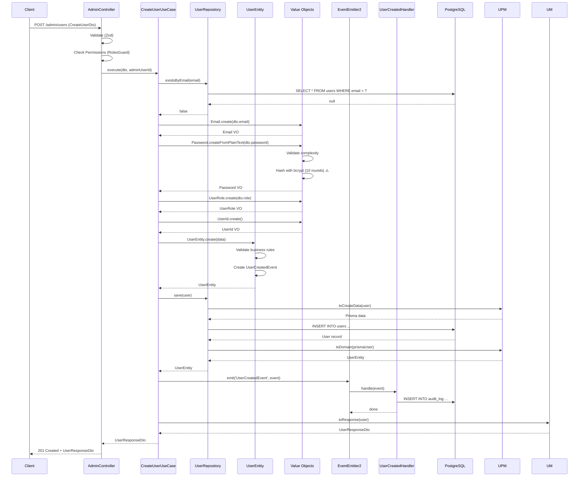
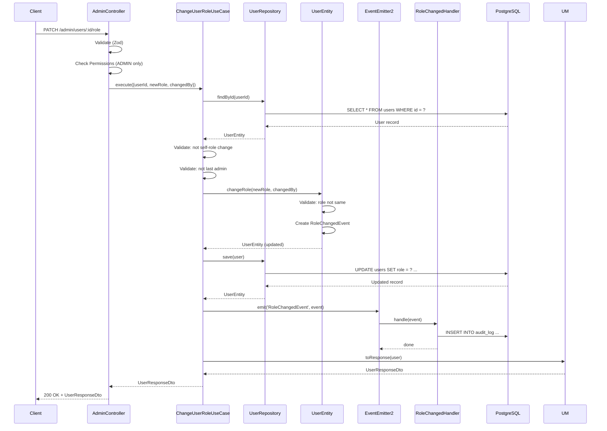
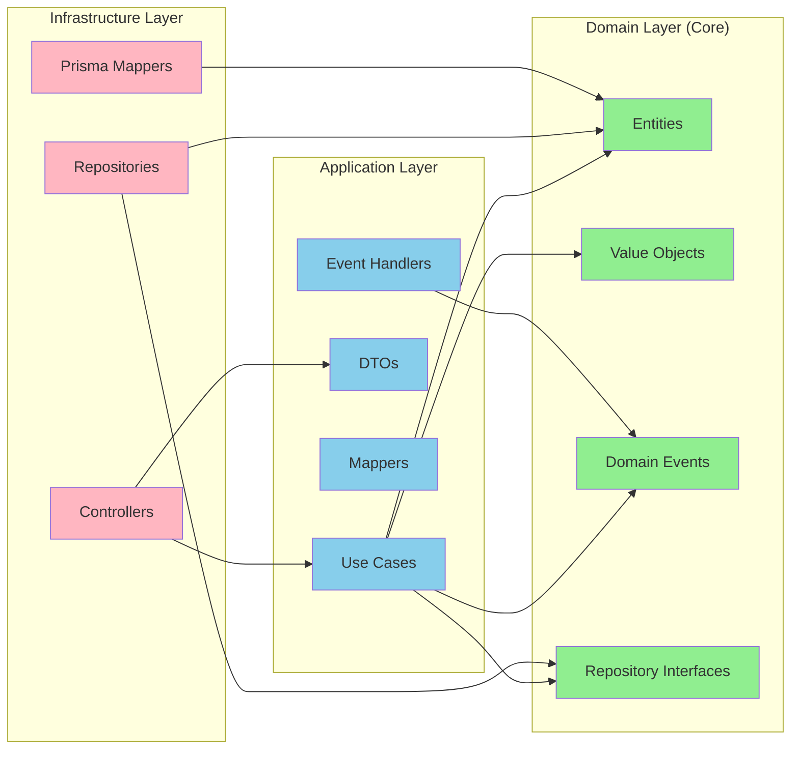

# 🏗️ DIAGRAMA DE ARQUITECTURA - MÓDULO `/admin`

**Fecha:** 2024-12-22  
**Versión:** Actual (Pre-refactorización)

---

## 📐 ARQUITECTURA ACTUAL (DDD)

```mermaid
graph TB
    subgraph "Infrastructure Layer"
        AC[AdminController]
        UR[UserRepository]
        UPM[UserPrismaMapper]
        AS[AdminService - Legacy]
    end

    subgraph "Application Layer"
        CUC[CreateUserUseCase]
        UUC[UpdateUserUseCase]
        CRUC[ChangeUserRoleUseCase]
        TAUC[ToggleUserActiveUseCase]
        RPUC[ResetPasswordUseCase]
        LUC[ListUsersUseCase]
        GUC[GetUserByIdUseCase]
        GSUC[GetUserStatsUseCase]
        
        UH[UserCreatedHandler]
        RCH[RoleChangedHandler]
        UDH[UserDeactivatedHandler]
        PRH[PasswordResetHandler]
        
        UM[UserMapper]
        CD[CreateUserDto]
        UD[UpdateUserDto]
        URD[UserResponseDto]
    end

    subgraph "Domain Layer"
        UE[UserEntity]
        E[Email VO]
        P[Password VO]
        UR_VO[UserRole VO]
        UI[UserId VO]
        
        UCE[UserCreatedEvent]
        RCE[RoleChangedEvent]
        UDE[UserDeactivatedEvent]
        PRE[PasswordResetEvent]
        
        IUR[IUserRepository Interface]
    end

    subgraph "External"
        PS[PrismaService]
        EE[EventEmitter2]
        DB[(PostgreSQL)]
    end

    %% Infrastructure → Application
    AC --> CUC
    AC --> UUC
    AC --> CRUC
    AC --> TAUC
    AC --> RPUC
    AC --> LUC
    AC --> GUC
    AC --> GSUC
    AC -.->|Legacy| AS

    %% Application → Domain
    CUC --> IUR
    CUC --> UE
    UUC --> IUR
    UUC --> UE
    CRUC --> IUR
    CRUC --> UE
    TAUC --> IUR
    TAUC --> UE
    RPUC --> IUR
    RPUC --> UE
    LUC --> IUR
    GUC --> IUR
    GSUC --> IUR

    CUC --> EE
    UUC --> EE
    CRUC --> EE
    TAUC --> EE
    RPUC --> EE

    %% Domain → Value Objects
    UE --> E
    UE --> P
    UE --> UR_VO
    UE --> UI

    %% Domain Events
    UE --> UCE
    UE --> RCE
    UE --> UDE
    UE --> PRE

    %% Event Handlers
    EE --> UH
    EE --> RCH
    EE --> UDH
    EE --> PRH

    %% Infrastructure → Domain
    UR --> IUR
    UR --> UPM
    UPM --> UE
    UR --> PS
    AS --> PS

    %% External
    PS --> DB
    UH --> PS

    %% Mappers
    CUC --> UM
    UUC --> UM
    UM --> URD

    style AS fill:#ffcccc,stroke:#ff0000,stroke-width:2px
    style IUR fill:#ccffcc,stroke:#00ff00,stroke-width:2px
    style UE fill:#ccffcc,stroke:#00ff00,stroke-width:2px
    style E fill:#ccffcc,stroke:#00ff00,stroke-width:2px
    style P fill:#ccffcc,stroke:#00ff00,stroke-width:2px
    style UR_VO fill:#ccffcc,stroke:#00ff00,stroke-width:2px
    style UI fill:#ccffcc,stroke:#00ff00,stroke-width:2px
```



---

## 🔄 FLUJO DE CREACIÓN DE USUARIO



---

## 🔄 FLUJO DE CAMBIO DE ROL



---

## 📊 DEPENDENCIAS ENTRE CAPAS



**Regla de Dependencias:** ✅ Correcta
- Domain no depende de nadie
- Application depende solo de Domain
- Infrastructure depende de Domain y Application

---

## 🚨 VIOLACIONES DE ARQUITECTURA

### 1. **Leaky Abstraction: AdminService**
```
AdminService → PrismaService (directo)
```
**Problema:** Service legacy usa Prisma directamente, viola DIP

### 2. **Event Handlers → PrismaService**
```
UserCreatedHandler → PrismaService (directo)
```
**Problema:** Handlers dependen de Prisma, deberían usar abstracción

---

## 📈 MÉTRICAS DE ACOPLAMIENTO

| Capa | Dependencias Externas | Acoplamiento |
|------|----------------------|--------------|
| Domain | 0 | ✅ Bajo |
| Application | Domain only | ✅ Bajo |
| Infrastructure | Domain + Application | ✅ Bajo |
| **Legacy (AdminService)** | **Prisma directo** | ⚠️ **Alto** |

---

## ✅ FORTALEZAS ARQUITECTÓNICAS

1. ✅ Separación de capas clara
2. ✅ Dependencias apuntan hacia adentro (Clean Architecture)
3. ✅ Repository Pattern implementado correctamente
4. ✅ Domain Events funcionando
5. ✅ Use Cases bien estructurados

---

## ⚠️ ÁREAS DE MEJORA

1. ⚠️ Eliminar `AdminService` legacy
2. ⚠️ Abstraer Prisma en Event Handlers
3. ⚠️ Agregar transacciones donde necesario
4. ⚠️ Mejorar inmutabilidad (Object.freeze)

---

**Siguiente:** Análisis de flujos de negocio detallados.

