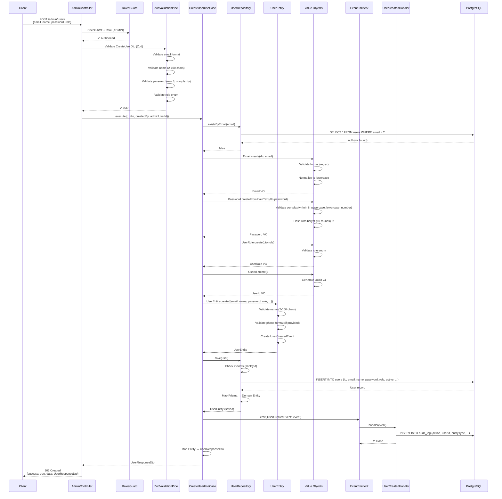
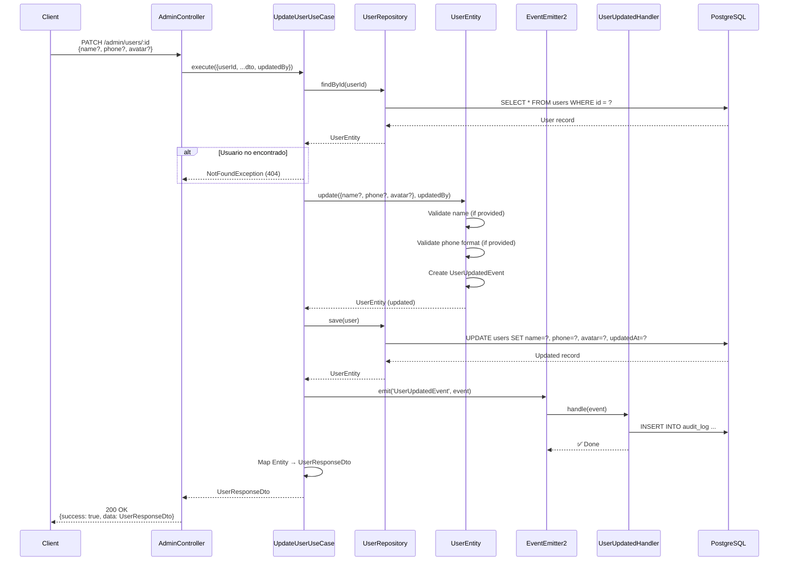
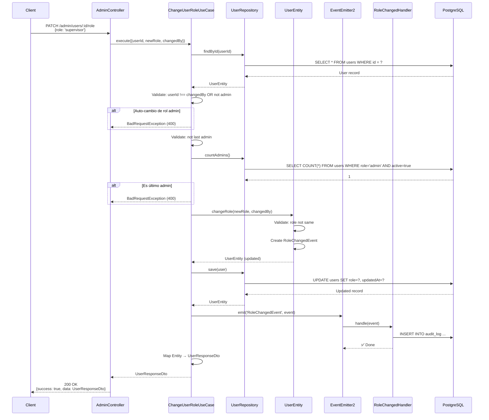
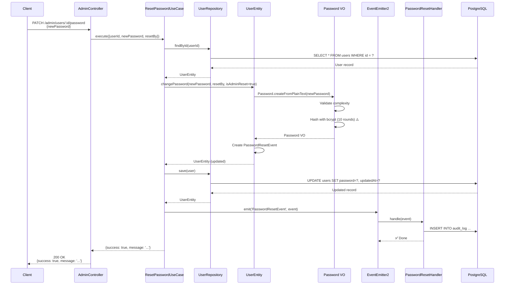
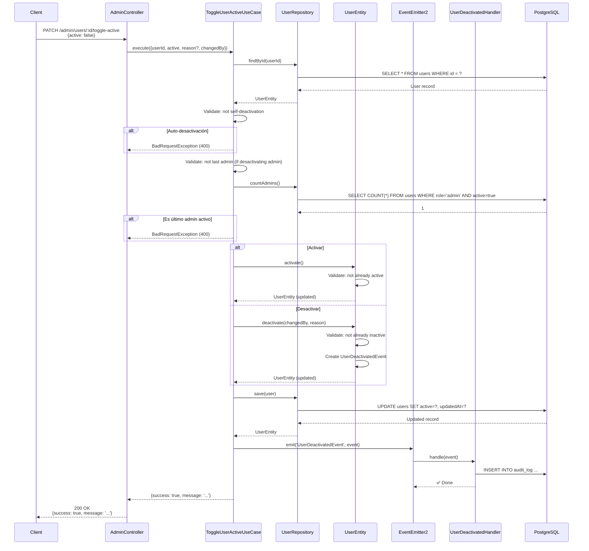
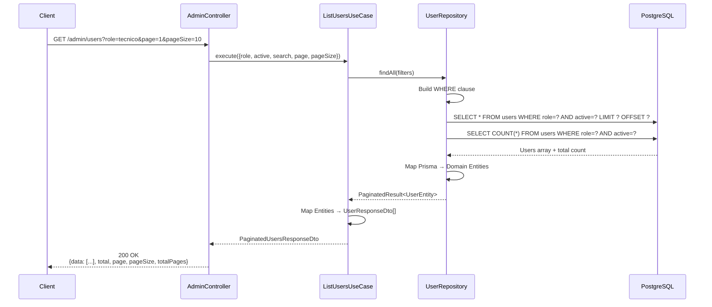
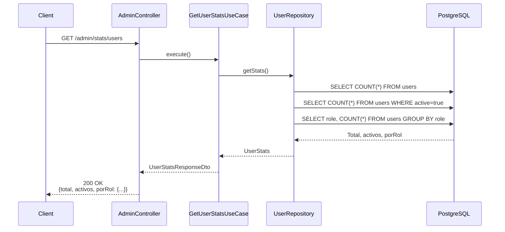

# 🔄 FLUJOS DE NEGOCIO - MÓDULO `/admin`

**Fecha:** 2024-12-22

---

## 📋 ÍNDICE DE FLUJOS

1. [Crear Usuario](#1-crear-usuario)
2. [Actualizar Usuario](#2-actualizar-usuario)
3. [Cambiar Rol de Usuario](#3-cambiar-rol-de-usuario)
4. [Reset Password](#4-reset-password)
5. [Activar/Desactivar Usuario](#5-activardesactivar-usuario)
6. [Listar Usuarios](#6-listar-usuarios)
7. [Obtener Estadísticas](#7-obtener-estadísticas)

---

## 1. CREAR USUARIO

### **Descripción:**
Un administrador crea un nuevo usuario en el sistema con email, nombre, contraseña y rol.

### **Actores:**
- **Actor Principal:** ADMIN
- **Actor Secundario:** Sistema (event handlers)

### **Precondiciones:**
- Usuario autenticado con rol ADMIN
- Token JWT válido

### **Flujo Principal:**

### **Validaciones:**

| Validación | Ubicación | Error |
|------------|-----------|-------|
| Email único | `CreateUserUseCase:38` | `ConflictException` |
| Email formato | `Email.vo:32` | `Error` (debería ser `ValidationError`) |
| Nombre 2-100 chars | `UserEntity:77` | `Error` |
| Password complejidad | `Password.vo:54` | `Error` |
| Rol válido | `UserRole.vo:31` | `Error` |

### **Casos Edge:**

1. **Email duplicado:**
   - Flujo: `existsByEmail()` retorna `true`
   - Resultado: `ConflictException` (409)

2. **Password débil:**
   - Flujo: `Password.createFromPlainText()` valida
   - Resultado: `Error` con feedback

3. **Rol inválido:**
   - Flujo: `UserRole.create()` valida
   - Resultado: `Error`

### **Problemas Identificados:**

| Problema | Ubicación | Impacto |
|----------|-----------|---------|
| bcrypt rounds = 10 | `Password.vo:19` | 🔴 CRÍTICO |
| Usa `Error` genérico | Múltiples | 🟠 ALTO |
| No transacción | `CreateUserUseCase` | 🟡 MEDIO |

---

## 2. ACTUALIZAR USUARIO

### **Descripción:**
Un administrador actualiza información básica de un usuario (nombre, teléfono, avatar).

### **Actores:**
- **Actor Principal:** ADMIN

### **Flujo Principal:**

### **Validaciones:**

| Validación | Ubicación | Error |
|------------|-----------|-------|
| Usuario existe | `UpdateUserUseCase:37` | `NotFoundException` |
| Nombre válido | `UserEntity:196` | `Error` |
| Teléfono formato | `UserEntity:207` | `Error` |

### **Casos Edge:**

1. **Usuario no encontrado:**
   - Resultado: `NotFoundException` (404)

2. **Sin cambios:**
   - Flujo: `user.update()` no detecta cambios
   - Resultado: No se emite evento, pero se retorna usuario

---

## 3. CAMBIAR ROL DE USUARIO

### **Descripción:**
Un administrador cambia el rol de un usuario.

### **Actores:**
- **Actor Principal:** ADMIN

### **Flujo Principal:**

### **Validaciones:**

| Validación | Ubicación | Error |
|------------|-----------|-------|
| Usuario existe | `ChangeUserRoleUseCase:43` | `NotFoundException` |
| No auto-cambio admin | `ChangeUserRoleUseCase:49` | `BadRequestException` |
| No último admin | `ChangeUserRoleUseCase:58` | `BadRequestException` |
| Rol diferente | `UserEntity:233` | `Error` |

### **Casos Edge:**

1. **Auto-cambio de rol admin:**
   - Flujo: `userId === changedBy && user.role.isAdmin() && newRole !== 'admin'`
   - Resultado: `BadRequestException` (400)

2. **Último admin:**
   - Flujo: `countAdmins() <= 1`
   - Resultado: `BadRequestException` (400)

3. **Mismo rol:**
   - Flujo: `user.role.equals(newRole)`
   - Resultado: `Error` (debería ser `BusinessRuleViolationError`)

### **Problemas Identificados:**

| Problema | Ubicación | Impacto |
|----------|-----------|---------|
| No transacción | `ChangeUserRoleUseCase` | 🟡 MEDIO |
| Usa `Error` genérico | `UserEntity:234` | 🟠 ALTO |

---

## 4. RESET PASSWORD

### **Descripción:**
Un administrador resetea la contraseña de un usuario.

### **Actores:**
- **Actor Principal:** ADMIN

### **Flujo Principal:**

### **Validaciones:**

| Validación | Ubicación | Error |
|------------|-----------|-------|
| Usuario existe | `ResetPasswordUseCase:45` | `NotFoundException` |
| Password complejidad | `Password.vo:54` | `Error` |

### **Problemas Identificados:**

| Problema | Ubicación | Impacto |
|----------|-----------|---------|
| bcrypt rounds = 10 | `Password.vo:19` | 🔴 CRÍTICO |
| No envía email | `PasswordResetHandler` | 🟡 MEDIO |

---

## 5. ACTIVAR/DESACTIVAR USUARIO

### **Descripción:**
Un administrador activa o desactiva un usuario (soft delete).

### **Actores:**
- **Actor Principal:** ADMIN

### **Flujo Principal:**

### **Validaciones:**

| Validación | Ubicación | Error |
|------------|-----------|-------|
| Usuario existe | `ToggleUserActiveUseCase:47` | `NotFoundException` |
| No auto-desactivación | `ToggleUserActiveUseCase:53` | `BadRequestException` |
| No último admin | `ToggleUserActiveUseCase:58` | `BadRequestException` |
| Ya activo/inactivo | `UserEntity:284,296` | `Error` |

### **Casos Edge:**

1. **Auto-desactivación:**
   - Flujo: `userId === changedBy && !active`
   - Resultado: `BadRequestException` (400)

2. **Último admin activo:**
   - Flujo: `countAdmins() <= 1 && user.role.isAdmin() && !active`
   - Resultado: `BadRequestException` (400)

---

## 6. LISTAR USUARIOS

### **Descripción:**
Un administrador lista usuarios con filtros y paginación.

### **Actores:**
- **Actor Principal:** ADMIN

### **Flujo Principal:**

### **Filtros Disponibles:**

| Filtro | Tipo | Descripción |
|--------|------|-------------|
| `role` | string | Filtrar por rol |
| `active` | boolean | Filtrar por estado activo |
| `search` | string | Búsqueda en nombre/email |
| `page` | number | Página (default: 1) |
| `pageSize` | number | Tamaño de página (default: 10) |

### **Optimizaciones:**

- ✅ Usa `Promise.all()` para queries paralelas
- ✅ Paginación eficiente (LIMIT/OFFSET)
- ✅ Búsqueda case-insensitive

---

## 7. OBTENER ESTADÍSTICAS

### **Descripción:**
Un administrador obtiene estadísticas de usuarios.

### **Actores:**
- **Actor Principal:** ADMIN

### **Flujo Principal:**

### **Estadísticas Retornadas:**

| Métrica | Descripción |
|---------|-------------|
| `total` | Total de usuarios |
| `activos` | Usuarios activos |
| `porRol` | Conteo por rol (admin, supervisor, tecnico, administrativo) |

### **Optimizaciones:**

- ✅ Queries agregadas eficientes
- ⚠️ Podría agregar caching (5 minutos)

---

## 📊 RESUMEN DE PROBLEMAS POR FLUJO

| Flujo | Problemas Críticos | Problemas Altos | Problemas Medios |
|-------|-------------------|-----------------|------------------|
| Crear Usuario | bcrypt rounds=10 | Error genérico | No transacción |
| Actualizar Usuario | - | Error genérico | - |
| Cambiar Rol | - | Error genérico | No transacción |
| Reset Password | bcrypt rounds=10 | - | No email |
| Activar/Desactivar | - | Error genérico | No transacción |
| Listar Usuarios | - | - | - |
| Estadísticas | - | - | Falta caching |

---

## ✅ RECOMENDACIONES POR FLUJO

### **Todos los Flujos:**
1. ✅ Agregar transacciones donde necesario
2. ✅ Reemplazar `Error` por excepciones custom
3. ✅ Mejorar logging estructurado

### **Flujos Críticos:**
1. 🔴 Cambiar bcrypt rounds a 12 (Crear, Reset Password)
2. 🟡 Agregar transacciones (Cambiar Rol, Activar/Desactivar)

### **Flujos de Lectura:**
1. 🟡 Agregar caching (Estadísticas)

---

**Siguiente:** Análisis de casos edge y validaciones faltantes.

