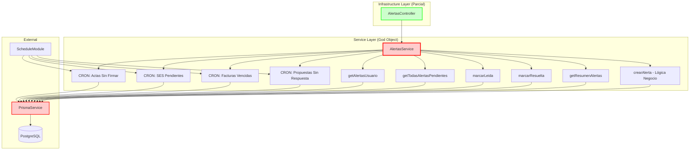
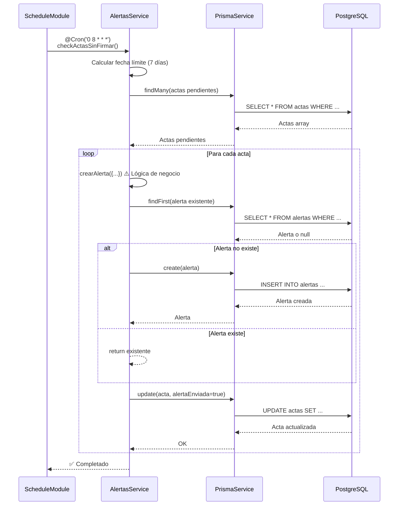
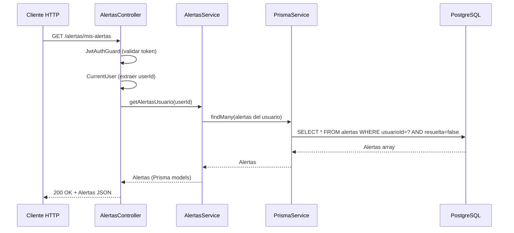
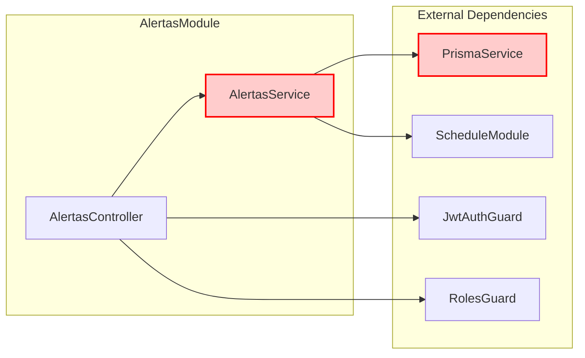

# 🏗️ ARQUITECTURA ACTUAL - MÓDULO `/alertas`

**Fecha:** 2024-12-22  
**Versión:** Actual (Pre-refactorización)

---

## 📐 ARQUITECTURA ACTUAL (Simplificada)



---

## 🔄 FLUJO ACTUAL: CREAR ALERTA (CRON)



**Problemas en este flujo:**
- ❌ Lógica de negocio en service (debería estar en domain)
- ❌ Dependencia directa de Prisma (debería usar repository)
- ❌ Sin validación de entrada
- ❌ Sin manejo de errores estructurado
- ❌ Sin domain events

---

## 🔄 FLUJO ACTUAL: OBTENER ALERTAS DE USUARIO



**Problemas en este flujo:**
- ❌ Retorna modelos Prisma directamente (debería retornar DTOs)
- ❌ Sin paginación
- ❌ Sin filtros
- ❌ Sin validación de entrada

---

## 📊 DEPENDENCIAS ACTUALES



**Regla de Dependencias:** ❌ **VIOLADA**
- Service depende directamente de Prisma (concreto)
- No hay abstracciones (interfaces)
- Difícil de testear (requiere mock de Prisma)

---

## 🚨 VIOLACIONES DE ARQUITECTURA

### 1. **God Object: AlertasService**
```
AlertasService tiene:
- 4 CRON jobs
- 5 métodos CRUD
- 2 métodos privados (lógica de negocio)
- Total: 11 métodos en una clase
```
**Problema:** Viola SRP (Single Responsibility Principle)

### 2. **Sin Separación de Capas**
```
No existe:
- Domain Layer (entities, VOs, events)
- Application Layer (use cases, DTOs, mappers)
- Infrastructure Layer completo (solo controller)
```
**Problema:** Todo está en el service

### 3. **Dependencias Concretas**
```
AlertasService → PrismaService (directo)
```
**Problema:** Viola DIP (Dependency Inversion Principle)

### 4. **Lógica de Negocio en Service**
```
crearAlerta() contiene:
- Validación de existencia
- Lógica de negocio (evitar duplicados)
- Persistencia directa
```
**Problema:** Debería estar en domain entity

---

## 📈 MÉTRICAS DE ACOPLAMIENTO

| Componente | Dependencias Externas | Acoplamiento |
|------------|----------------------|--------------|
| AlertasService | PrismaService, ScheduleModule | 🔴 **ALTO** |
| AlertasController | AlertasService, Guards | 🟡 **MEDIO** |
| **Domain Layer** | **NO EXISTE** | - |
| **Application Layer** | **NO EXISTE** | - |

---

## ✅ FORTALEZAS ARQUITECTÓNICAS

1. ✅ Controller delgado (buena práctica)
2. ✅ Guards implementados (seguridad básica)
3. ✅ CRONs funcionando correctamente
4. ✅ Logging básico presente

---

## ⚠️ ÁREAS DE MEJORA CRÍTICAS

1. 🔴 **Eliminar God Object** - Separar responsabilidades
2. 🔴 **Crear Domain Layer** - Entities, VOs, Events
3. 🔴 **Crear Application Layer** - Use Cases, DTOs
4. 🔴 **Abstraer Prisma** - Repository Pattern
5. 🟠 **Sistema de Queue** - Procesamiento asíncrono
6. 🟠 **Retry Mechanism** - Manejo de fallos

---

## 📝 CONCLUSIÓN

La arquitectura actual es **muy simplificada** y requiere una **refactorización completa** a DDD + Clean Architecture. El principal problema es el **God Object (AlertasService)** que mezcla múltiples responsabilidades.

**Siguiente:** Diseñar arquitectura objetivo (DDD).

