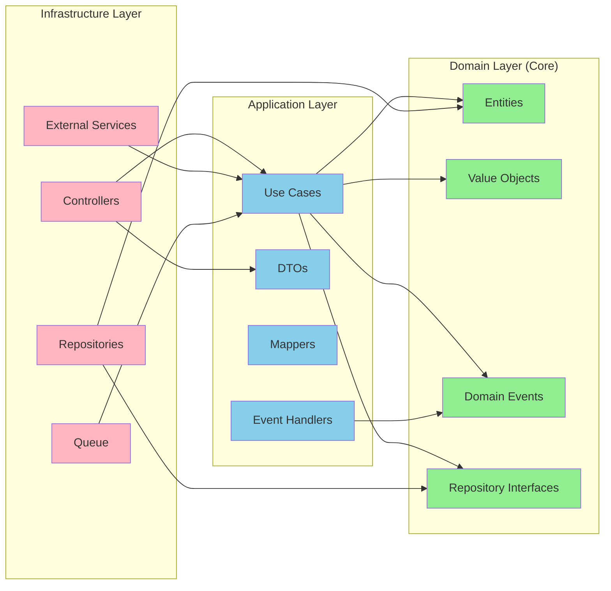
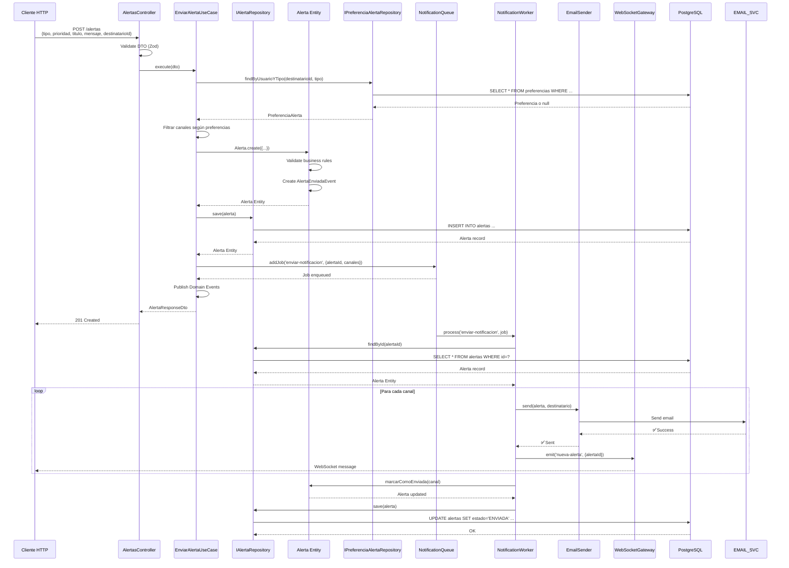

# 🏗️ ARQUITECTURA OBJETIVO (DDD) - MÓDULO `/alertas`

**Fecha:** 2024-12-22  
**Versión:** 1.0 (Objetivo)

---

## 📐 ARQUITECTURA OBJETIVO (DDD + Clean Architecture)

```mermaid
graph TB
    subgraph "Infrastructure Layer"
        AC[AlertasController]
        PC[PreferenciasController]
        AR[AlertaRepository - Prisma]
        PR[PreferenciaAlertaRepository - Prisma]
        ES[EmailSenderService]
        PS[PushNotificationService]
        SS[SmsSenderService]
        IS[InAppNotificationService]
        NQ[NotificationQueueService - Bull]
        WS[WebSocketGateway]
    end

    subgraph "Application Layer"
        UC1[EnviarAlertaUseCase]
        UC2[ObtenerHistorialAlertasUseCase]
        UC3[ActualizarPreferenciasUseCase]
        UC4[ReintentarEnvioUseCase]
        UC5[MarcarComoLeidaUseCase]
        UC6[DetectarActasSinFirmarUseCase]
        UC7[DetectarSESPendientesUseCase]
        UC8[DetectarFacturasVencidasUseCase]
        
        EH1[AlertaEnviadaHandler]
        EH2[AlertaFallidaHandler]
        EH3[PreferenciaActualizadaHandler]
        
        AM[AlertaMapper]
        PM[PreferenciaMapper]
    end

    subgraph "Domain Layer"
        AE[Alerta Entity]
        PAE[PreferenciaAlerta Entity]
        
        AID[AlertaId VO]
        TA[TipoAlerta VO]
        PA[PrioridadAlerta VO]
        CN[CanalNotificacion VO]
        EA[EstadoAlerta VO]
        
        AEE[AlertaEnviadaEvent]
        AFE[AlertaFallidaEvent]
        PAE_EV[PreferenciaActualizadaEvent]
        
        IAR[IAlertaRepository Interface]
        IPAR[IPreferenciaAlertaRepository Interface]
    end

    subgraph "External"
        PS_EXT[PrismaService]
        DB[(PostgreSQL)]
        BULL[BullMQ]
        EMAIL_SVC[Email Service]
        PUSH_SVC[Push Service]
        SMS_SVC[SMS Service]
    end

    %% Infrastructure → Application
    AC --> UC1
    AC --> UC2
    AC --> UC5
    PC --> UC3
    
    %% Application → Domain
    UC1 --> IAR
    UC1 --> IPAR
    UC1 --> AE
    UC2 --> IAR
    UC3 --> IPAR
    UC3 --> PAE
    UC4 --> IAR
    UC5 --> IAR
    UC6 --> IAR
    UC7 --> IAR
    UC8 --> IAR
    
    UC1 --> NQ
    UC4 --> NQ
    
    %% Domain → Value Objects
    AE --> AID
    AE --> TA
    AE --> PA
    AE --> CN
    AE --> EA
    PAE --> TA
    PAE --> CN
    
    %% Domain Events
    AE --> AEE
    AE --> AFE
    PAE --> PAE_EV
    
    %% Event Handlers
    AEE --> EH1
    AFE --> EH2
    PAE_EV --> EH3
    
    %% Infrastructure → Domain
    AR -.implements.-> IAR
    PR -.implements.-> IPAR
    AR --> PS_EXT
    PR --> PS_EXT
    
    %% Infrastructure → External
    PS_EXT --> DB
    NQ --> BULL
    BULL --> ES
    BULL --> PS
    BULL --> SS
    BULL --> IS
    
    ES --> EMAIL_SVC
    PS --> PUSH_SVC
    SS --> SMS_SVC
    IS --> WS
    
    %% Mappers
    UC1 --> AM
    UC2 --> AM
    UC3 --> PM
    
    style AE fill:#90EE90,stroke:#00ff00,stroke-width:2px
    style PAE fill:#90EE90,stroke:#00ff00,stroke-width:2px
    style AID fill:#90EE90,stroke:#00ff00,stroke-width:2px
    style TA fill:#90EE90,stroke:#00ff00,stroke-width:2px
    style PA fill:#90EE90,stroke:#00ff00,stroke-width:2px
    style CN fill:#90EE90,stroke:#00ff00,stroke-width:2px
    style EA fill:#90EE90,stroke:#00ff00,stroke-width:2px
    style IAR fill:#90EE90,stroke:#00ff00,stroke-width:2px
    style IPAR fill:#90EE90,stroke:#00ff00,stroke-width:2px
    style UC1 fill:#87CEEB,stroke:#0000ff,stroke-width:2px
    style UC2 fill:#87CEEB,stroke:#0000ff,stroke-width:2px
    style UC3 fill:#87CEEB,stroke:#0000ff,stroke-width:2px
    style AR fill:#FFB6C1,stroke:#ff00ff,stroke-width:2px
    style PR fill:#FFB6C1,stroke:#ff00ff,stroke-width:2px
```



---

## 📊 DEPENDENCIAS ENTRE CAPAS



**Regla de Dependencias:** ✅ **CORRECTA**
- Domain no depende de nadie
- Application depende solo de Domain
- Infrastructure depende de Domain y Application

---

## 🏛️ ESTRUCTURA DE DIRECTORIOS

```
📁alertas/
├── 📁domain/                     # Capa de Dominio
│   ├── 📁entities/
│   │   ├── alerta.entity.ts
│   │   ├── preferencia-alerta.entity.ts
│   │   └── index.ts
│   ├── 📁value-objects/
│   │   ├── alerta-id.vo.ts
│   │   ├── tipo-alerta.vo.ts
│   │   ├── prioridad-alerta.vo.ts
│   │   ├── canal-notificacion.vo.ts
│   │   ├── estado-alerta.vo.ts
│   │   └── index.ts
│   ├── 📁events/
│   │   ├── alerta-enviada.event.ts
│   │   ├── alerta-fallida.event.ts
│   │   ├── preferencia-actualizada.event.ts
│   │   └── index.ts
│   ├── 📁repositories/
│   │   ├── alerta.repository.interface.ts
│   │   ├── preferencia-alerta.repository.interface.ts
│   │   └── index.ts
│   ├── 📁exceptions/
│   │   ├── validation.error.ts
│   │   ├── business-rule-violation.error.ts
│   │   └── index.ts
│   └── index.ts
├── 📁application/                # Capa de Aplicación
│   ├── 📁use-cases/
│   │   ├── enviar-alerta.use-case.ts
│   │   ├── obtener-historial-alertas.use-case.ts
│   │   ├── actualizar-preferencias.use-case.ts
│   │   ├── reintentar-envio.use-case.ts
│   │   ├── marcar-como-leida.use-case.ts
│   │   ├── detectar-actas-sin-firmar.use-case.ts
│   │   ├── detectar-ses-pendientes.use-case.ts
│   │   ├── detectar-facturas-vencidas.use-case.ts
│   │   └── index.ts
│   ├── 📁dto/
│   │   ├── enviar-alerta.dto.ts
│   │   ├── alerta-response.dto.ts
│   │   ├── preferencias-alerta.dto.ts
│   │   ├── historial-query.dto.ts
│   │   └── index.ts
│   ├── 📁mappers/
│   │   ├── alerta.mapper.ts
│   │   ├── preferencia.mapper.ts
│   │   └── index.ts
│   ├── 📁event-handlers/
│   │   ├── alerta-enviada.handler.ts
│   │   ├── alerta-fallida.handler.ts
│   │   ├── preferencia-actualizada.handler.ts
│   │   └── index.ts
│   └── index.ts
├── 📁infrastructure/             # Capa de Infraestructura
│   ├── 📁controllers/
│   │   ├── alertas.controller.ts
│   │   ├── preferencias.controller.ts
│   │   └── index.ts
│   ├── 📁persistence/
│   │   ├── alerta.repository.ts
│   │   ├── preferencia-alerta.repository.ts
│   │   ├── alerta.prisma.mapper.ts
│   │   ├── preferencia.prisma.mapper.ts
│   │   └── index.ts
│   ├── 📁services/
│   │   ├── 📁notification-senders/
│   │   │   ├── notification-sender.interface.ts
│   │   │   ├── email-sender.service.ts
│   │   │   ├── push-notification.service.ts
│   │   │   ├── sms-sender.service.ts
│   │   │   ├── in-app-notification.service.ts
│   │   │   └── index.ts
│   │   ├── notification-queue.service.ts
│   │   ├── websocket-gateway.service.ts
│   │   └── index.ts
│   └── index.ts
├── alertas.module.ts
└── README.md
```

---

## 🔄 FLUJOS DE ARQUITECTURA

### **Flujo: Enviar Alerta**



---

### **Flujo: Detección Automática (CRON)**

```mermaid
sequenceDiagram
    participant CRON as ScheduleModule
    participant UC as DetectarActasSinFirmarUseCase
    participant REPO as IAlertaRepository
    participant ACTA_REPO as IActaRepository (externo)
    participant ENTITY as Alerta Entity
    participant QUEUE as NotificationQueue
    participant DB as PostgreSQL

    CRON->>UC: @Cron('0 8 * * *')<br/>execute()
    
    UC->>ACTA_REPO: findActasSinFirmar(7 días)
    ACTA_REPO->>DB: SELECT * FROM actas WHERE ...
    DB-->>ACTA_REPO: Actas array
    ACTA_REPO-->>UC: Actas[]
    
    loop Para cada acta
        UC->>REPO: findExistentAlerta(ordenId, 'ACTA_SIN_FIRMAR')
        REPO->>DB: SELECT * FROM alertas WHERE ...
        DB-->>REPO: Alerta o null
        
        alt Alerta no existe
            UC->>ENTITY: Alerta.create({
                tipo: 'ACTA_SIN_FIRMAR',
                prioridad: 'WARNING',
                destinatarioId: acta.asignadoId,
                ...
            })
            ENTITY-->>UC: Alerta Entity
            
            UC->>REPO: save(alerta)
            REPO->>DB: INSERT INTO alertas ...
            DB-->>REPO: OK
            
            UC->>QUEUE: addJob('enviar-notificacion', {alertaId})
            QUEUE-->>UC: Job enqueued
        end
        
        UC->>ACTA_REPO: marcarAlertaEnviada(actaId)
        ACTA_REPO->>DB: UPDATE actas SET alertaEnviada=true ...
        DB-->>ACTA_REPO: OK
    end
    
    UC-->>CRON: ✅ Completado
```

---

## 📦 COMPONENTES PRINCIPALES

### **Domain Layer**

#### **Entities:**
- **Alerta** (Aggregate Root)
  - Propiedades: id, tipo, prioridad, titulo, mensaje, destinatarioId, canales, estado, intentosEnvio, etc.
  - Métodos: `marcarComoEnviada()`, `marcarComoFallida()`, `marcarComoLeida()`, `puedeReintentar()`, etc.

- **PreferenciaAlerta**
  - Propiedades: id, usuarioId, tipoAlerta, canalesPreferidos, noMolestar, horariosPermitidos
  - Métodos: `permiteNotificacionEn()`, `estaEnHorarioPermitido()`, etc.

#### **Value Objects:**
- `AlertaId` - UUID v4
- `TipoAlerta` - Enum con tipos de alerta
- `PrioridadAlerta` - Enum (CRITICAL, ERROR, WARNING, INFO)
- `CanalNotificacion` - Enum (EMAIL, PUSH, SMS, IN_APP)
- `EstadoAlerta` - Enum (PENDIENTE, PROCESANDO, ENVIADA, FALLIDA, LEIDA)

#### **Domain Events:**
- `AlertaEnviadaEvent` - Se publica cuando se envía exitosamente
- `AlertaFallidaEvent` - Se publica cuando falla el envío
- `PreferenciaActualizadaEvent` - Se publica cuando se actualizan preferencias

#### **Repository Interfaces:**
- `IAlertaRepository` - Contrato para persistencia de alertas
- `IPreferenciaAlertaRepository` - Contrato para persistencia de preferencias

---

### **Application Layer**

#### **Use Cases:**
1. `EnviarAlertaUseCase` - Envía una alerta a un usuario
2. `ObtenerHistorialAlertasUseCase` - Obtiene historial paginado
3. `ActualizarPreferenciasUseCase` - Actualiza preferencias de usuario
4. `ReintentarEnvioUseCase` - Reintenta envío de alertas fallidas
5. `MarcarComoLeidaUseCase` - Marca alerta como leída
6. `DetectarActasSinFirmarUseCase` - CRON: Detecta actas sin firmar
7. `DetectarSESPendientesUseCase` - CRON: Detecta SES pendientes
8. `DetectarFacturasVencidasUseCase` - CRON: Detecta facturas vencidas

#### **DTOs:**
- `EnviarAlertaDto` - Input para enviar alerta
- `AlertaResponseDto` - Output de alerta
- `PreferenciasAlertaDto` - Input/Output de preferencias
- `HistorialQueryDto` - Query para historial (paginación, filtros)

#### **Mappers:**
- `AlertaMapper` - Domain Entity ↔ DTO
- `PreferenciaMapper` - Domain Entity ↔ DTO

#### **Event Handlers:**
- `AlertaEnviadaHandler` - Reacciona a AlertaEnviadaEvent
- `AlertaFallidaHandler` - Reacciona a AlertaFallidaEvent
- `PreferenciaActualizadaHandler` - Reacciona a PreferenciaActualizadaEvent

---

### **Infrastructure Layer**

#### **Controllers:**
- `AlertasController` - Endpoints HTTP para alertas
- `PreferenciasController` - Endpoints HTTP para preferencias

#### **Repositories:**
- `AlertaRepository` - Implementa IAlertaRepository con Prisma
- `PreferenciaAlertaRepository` - Implementa IPreferenciaAlertaRepository con Prisma

#### **Services:**
- `EmailSenderService` - Implementa INotificationSender para EMAIL
- `PushNotificationService` - Implementa INotificationSender para PUSH
- `SmsSenderService` - Implementa INotificationSender para SMS
- `InAppNotificationService` - Implementa INotificationSender para IN_APP
- `NotificationQueueService` - Gestiona queue de Bull/BullMQ
- `WebSocketGateway` - Notificaciones en tiempo real

---

## 🔐 SEGURIDAD Y VALIDACIÓN

### **Validación:**
- ✅ DTOs con class-validator + Zod
- ✅ Value Objects con validación de dominio
- ✅ Entities con validación de invariantes

### **Autenticación/Autorización:**
- ✅ JwtAuthGuard en todos los endpoints
- ✅ RolesGuard para endpoints administrativos
- ✅ Validación de permisos en Use Cases

### **Rate Limiting:**
- ✅ ThrottlerGuard en endpoints sensibles
- ✅ Límites por rol

---

## 📈 ESCALABILIDAD

### **Queue System:**
- ✅ Bull/BullMQ para procesamiento asíncrono
- ✅ Workers escalables horizontalmente
- ✅ Retry automático con backoff exponencial

### **Base de Datos:**
- ✅ Índices en campos frecuentemente consultados
- ✅ Paginación eficiente
- ✅ Queries optimizadas

---

## ✅ CONCLUSIÓN

La arquitectura objetivo sigue **DDD + Clean Architecture** con:
- ✅ Separación clara de capas
- ✅ Dependencias apuntando hacia adentro
- ✅ Domain puro (sin dependencias externas)
- ✅ Application orquesta casos de uso
- ✅ Infrastructure implementa detalles técnicos

**Siguiente:** Generar diagrama de dominio y flujos de secuencia detallados.

