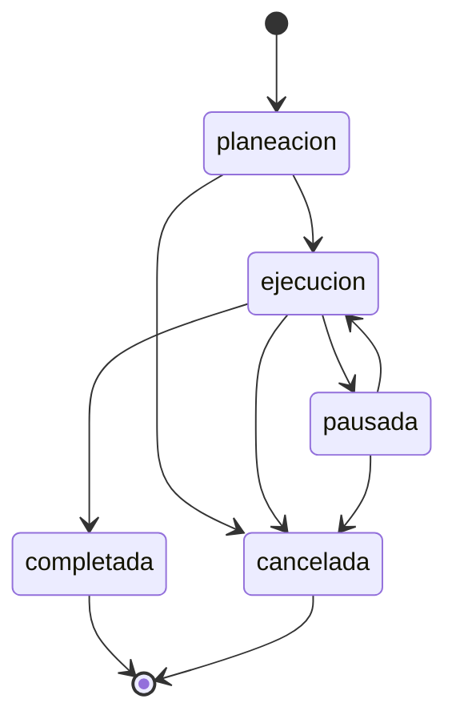

# Módulo Orders

## Descripción
Módulo de gestión de órdenes de trabajo con arquitectura DDD (Domain-Driven Design).

## Arquitectura

```
Orders/
├── domain/
│   ├── entities/
│   │   └── Order.entity.ts       # Entidad principal
│   └── value-objects/
│       ├── Order-numero.vo.ts    # Número único ORD-XXXXXX
│       ├── Order-estado.vo.ts    # Estados y transiciones
│       └── prioridad.vo.ts       # Niveles de prioridad
│
├── application/
│   ├── dto/                      # DTOs con validación Zod
│   └── use-cases/
│       ├── create-Order.use-case.ts
│       ├── list-Orders.use-case.ts
│       ├── get-Order-by-id.use-case.ts
│       ├── update-Order.use-case.ts
│       ├── change-estado.use-case.ts
│       └── delete-Order.use-case.ts
│
├── infrastructure/
│   ├── controllers/
│   │   └── Orders.controller.ts  # API REST
│   └── persistence/
│       └── Order.repository.ts    # Prisma implementation
│
└── Orders.module.ts
```

## Estados de Order



## Endpoints

| Método | Ruta | Descripción |
|--------|------|-------------|
| GET | /Orders | Listar órdenes (paginado) |
| GET | /Orders/:id | Obtener Order por ID |
| POST | /Orders | Crear nueva Order |
| PUT | /Orders/:id | Actualizar Order |
| PATCH | /Orders/:id/estado | Cambiar estado |
| DELETE | /Orders/:id | Eliminar Order |

## Uso

```typescript
// Crear Order
POST /Orders
{
  "descripcion": "Mantenimiento preventivo",
  "cliente": "Empresa XYZ",
  "prioridad": "alta",
  "asignadoId": "tecnico-uuid"
}

// Cambiar estado
PATCH /Orders/:id/estado
{
  "nuevoEstado": "ejecucion"
}
```

## Tests

```bash
# Tests unitarios
pnpm test -- --testPathPattern=Orders

# Con coverage
pnpm test:cov
```
