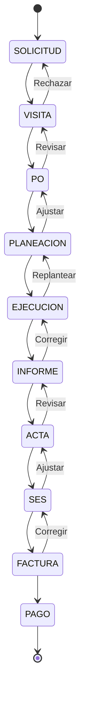
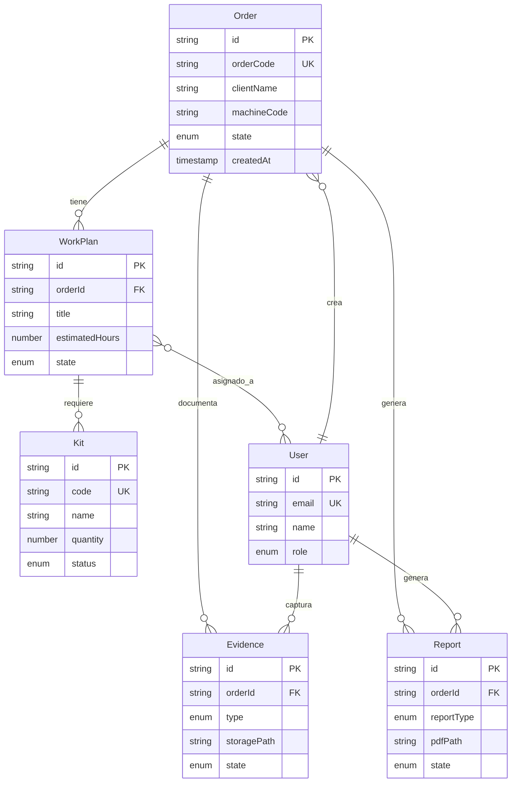

# Fase 2: Diseño de Solución - CERMONT S.A.S.

**Duración**: 3-4 semanas  
**Estado**: ✅ COMPLETADA  
**Fecha de inicio**: Octubre 2024  
**Fecha de finalización**: Noviembre 2024

---

## 1. Adaptación del Modelo Base

El sistema desarrollado para CERMONT S.A.S. ha sido diseñado específicamente para las necesidades de la empresa en el sector de servicios técnicos y mantenimiento industrial. A continuación se detallan los componentes adaptados:

### 1.1 Componentes del Sistema

| Componente | Descripción | Nivel de Personalización | Estado |
|------------|-------------|-------------------------|--------|
| **Autenticación** | Login, roles JWT, permisos RBAC | Baja | ✅ Implementado |
| **Gestión de usuarios** | CRUD empleados, roles, certificaciones | Media | ✅ Implementado |
| **Catálogo de servicios** | Tipos de trabajo, procedimientos, kits | Alta | ✅ Implementado |
| **Máquina de estados** | Flujo de estados de órdenes personalizado | Alta | ✅ Implementado |
| **Plantillas de documentos** | Formatos de informes, SES, actas | Alta | ✅ Implementado |
| **Integraciones** | API REST, exportación PDF | Media | ✅ Implementado |
| **Dashboard y reportes** | KPIs personalizados, métricas | Media | ✅ Implementado |
| **Captura de evidencias** | Fotos, firmas digitales, geolocalización | Baja | ✅ Implementado |
| **Modo offline** | Sincronización con IndexedDB | Baja | ✅ Implementado |

---

## 2. Definición de Estados de Orden de Trabajo

### 2.1 Máquina de Estados CERMONT

El sistema implementa un flujo de trabajo específico para el proceso de órdenes de trabajo de CERMONT S.A.S.:

```typescript
// Flujo de estados implementado en OrderStateMachine.ts
const ESTADOS_ORDEN = {
  SOLICITUD: { 
    siguiente: ['VISITA'],
    descripción: 'Orden recibida, pendiente de visita técnica inicial'
  },
  
  VISITA: { 
    siguiente: ['PO', 'SOLICITUD'],
    descripción: 'Visita técnica realizada, definir si requiere PO'
  },
  
  PO: { 
    siguiente: ['PLANEACION', 'VISITA'],
    descripción: 'Purchase Order recibida del cliente, autorización de trabajo'
  },
  
  PLANEACION: { 
    siguiente: ['EJECUCION', 'PO'],
    descripción: 'Plan de trabajo definido, recursos asignados'
  },
  
  EJECUCION: { 
    siguiente: ['INFORME', 'PLANEACION'],
    descripción: 'Trabajo en campo en progreso'
  },
  
  INFORME: { 
    siguiente: ['ACTA', 'EJECUCION'],
    descripción: 'Informe técnico generado'
  },
  
  ACTA: { 
    siguiente: ['SES', 'INFORME'],
    descripción: 'Acta de conformidad firmada por cliente'
  },
  
  SES: { 
    siguiente: ['FACTURA', 'ACTA'],
    descripción: 'Solicitud de Especificaciones preparada'
  },
  
  FACTURA: { 
    siguiente: ['PAGO', 'SES'],
    descripción: 'Factura emitida'
  },
  
  PAGO: { 
    siguiente: [],
    descripción: 'Pago recibido - Estado terminal'
  }
};
```

### 2.2 Diagrama de Flujo de Estados



### 2.3 Cálculo de Progreso

El sistema calcula automáticamente el progreso de cada orden basándose en su posición en la secuencia de estados:

| Estado | Progreso | Fase del Proyecto |
|--------|----------|-------------------|
| SOLICITUD | 0% | Iniciación |
| VISITA | 11% | Iniciación |
| PO | 22% | Planeación |
| PLANEACION | 33% | Planeación |
| EJECUCION | 44% | Ejecución |
| INFORME | 56% | Documentación |
| ACTA | 67% | Documentación |
| SES | 78% | Cierre |
| FACTURA | 89% | Cierre |
| PAGO | 100% | Completado |

---

## 3. Modelo de Datos

### 3.1 Entidades Principales

#### **Order (Orden de Trabajo)**
```typescript
interface Order {
  id: string;                  // UUID
  orderCode: string;           // Código único (ORD-YYYY-NNNN)
  clientName: string;
  machineCode: string;
  location: string;
  state: OrderState;           // Estado actual
  priority: 'normal' | 'alta';
  assignedTo: string[];        // IDs de usuarios asignados
  createdAt: Date;
  updatedAt: Date;
  estimatedStartDate?: Date;
  actualStartDate?: Date;
  estimatedEndDate?: Date;
  actualEndDate?: Date;
  description?: string;
  
  // Relaciones
  workPlans: WorkPlan[];
  evidences: Evidence[];
  reports: Report[];
}
```

#### **WorkPlan (Plan de Trabajo)**
```typescript
interface WorkPlan {
  id: string;
  orderId: string;
  title: string;
  description: string;
  estimatedHours: number;
  actualHours?: number;
  state: 'pendiente' | 'aprobado' | 'rechazado' | 'completado';
  createdBy: string;
  approvedBy?: string;
  createdAt: Date;
  approvedAt?: Date;
  
  // Relaciones
  kits: Kit[];
  personnel: User[];
}
```

#### **Kit (Equipo/Material)**
```typescript
interface Kit {
  id: string;
  code: string;
  name: string;
  description?: string;
  category: string;
  quantity: number;
  unit: string;
  status: 'disponible' | 'en_uso' | 'mantenimiento';
  location?: string;
}
```

#### **Evidence (Evidencia)**
```typescript
interface Evidence {
  id: string;
  orderId: string;
  workPlanId?: string;
  type: 'foto' | 'video' | 'documento' | 'firma';
  filename: string;
  storagePath: string;
  capturedAt: Date;
  capturedBy: string;
  latitude?: number;
  longitude?: number;
  state: 'pendiente' | 'aprobada' | 'rechazada';
  comments?: string;
}
```

#### **Report (Informe)**
```typescript
interface Report {
  id: string;
  orderId: string;
  reportType: 'informe' | 'acta' | 'ses';
  generatedAt: Date;
  generatedBy: string;
  pdfPath: string;
  content: JSON;              // Datos estructurados del reporte
  signedBy?: string[];
  state: 'borrador' | 'final' | 'firmado';
}
```

### 3.2 Diagrama Entidad-Relación



---

## 4. Arquitectura del Sistema

### 4.1 Arquitectura de Capas

```
┌─────────────────────────────────────────┐
│         Frontend (Next.js)              │
│  - React Components                     │
│  - State Management (React Context)     │
│  - Offline-first (IndexedDB)            │
│  - PWA Support                          │
└──────────────┬──────────────────────────┘
               │ HTTP/REST
               │ JSON
┌──────────────▼──────────────────────────┐
│         Backend (Express.js)            │
│  ┌─────────────────────────────────┐   │
│  │  HTTP Layer (Controllers)       │   │
│  └────────────┬────────────────────┘   │
│               │                         │
│  ┌────────────▼────────────────────┐   │
│  │  Application Layer (Use Cases)  │   │
│  └────────────┬────────────────────┘   │
│               │                         │
│  ┌────────────▼────────────────────┐   │
│  │  Domain Layer (Entities)        │   │
│  │  - Business Logic               │   │
│  │  - State Machine                │   │
│  └────────────┬────────────────────┘   │
│               │                         │
│  ┌────────────▼────────────────────┐   │
│  │  Infrastructure Layer           │   │
│  │  - Repositories (Prisma)        │   │
│  │  - File Storage                 │   │
│  └─────────────────────────────────┘   │
└──────────────┬──────────────────────────┘
               │
┌──────────────▼──────────────────────────┐
│         PostgreSQL Database             │
│  - Orders, WorkPlans, Kits              │
│  - Users, Evidences, Reports            │
└─────────────────────────────────────────┘
```

### 4.2 Patrones de Diseño Aplicados

1. **Clean Architecture**: Separación en capas con dependencias hacia el centro
2. **Repository Pattern**: Abstracción del acceso a datos
3. **Use Case Pattern**: Encapsulación de lógica de aplicación
4. **State Machine Pattern**: Control de flujo de estados
5. **Dependency Injection**: Inyección de dependencias en constructores
6. **DTO Pattern**: Transferencia de datos entre capas

---

## 5. Seguridad y Control de Acceso

### 5.1 Roles Definidos

| Rol | Permisos | Responsabilidades |
|-----|----------|-------------------|
| **OPERARIO** | - Ver órdenes asignadas<br>- Capturar evidencias<br>- Ejecutar en campo | Técnico de campo |
| **SUPERVISOR** | - Todo lo de OPERARIO<br>- Crear órdenes<br>- Aprobar planes de trabajo<br>- Aprobar evidencias | Líder de proyecto |
| **ADMIN** | - Todo lo de SUPERVISOR<br>- Gestionar usuarios<br>- Ver todos los reportes<br>- Configurar sistema | Administrador del sistema |
| **GERENCIA** | - Ver dashboard ejecutivo<br>- Ver todos los reportes<br>- Exportar datos masivos | Gerencia |

### 5.2 Matriz de Permisos

| Funcionalidad | OPERARIO | SUPERVISOR | ADMIN | GERENCIA |
|---------------|----------|------------|-------|----------|
| Ver órdenes asignadas | ✅ | ✅ | ✅ | ✅ |
| Crear órdenes | ❌ | ✅ | ✅ | ✅ |
| Ejecutar en campo | ✅ | ✅ | ✅ | ❌ |
| Aprobar plan de trabajo | ❌ | ✅ | ✅ | ✅ |
| Aprobar evidencias | ❌ | ✅ | ✅ | ✅ |
| Ver todos los reportes | ❌ | ❌ | ✅ | ✅ |
| Gestionar usuarios | ❌ | ❌ | ✅ | ❌ |
| Dashboard ejecutivo | ❌ | ❌ | ✅ | ✅ |
| Configurar sistema | ❌ | ❌ | ✅ | ❌ |
| Exportar datos masivos | ❌ | ❌ | ❌ | ✅ |

---

## 6. Integraciones y Extensiones

### 6.1 Almacenamiento de Archivos

- **Desarrollo**: Sistema de archivos local (`backend/uploads/`)
- **Producción**: AWS S3 o compatible (MinIO)
- **Tipos permitidos**: PDF, JPG, PNG, MP4 (max 10MB por archivo)

### 6.2 Generación de Documentos

- **Biblioteca**: PDFKit
- **Plantillas**: Informes técnicos, Actas, SES
- **Características**: Logo corporativo, firmas digitales, metadatos

### 6.3 Notificaciones (Futuro)

- Email (Node mailer + SMTP)
- Push notifications (PWA)
- WhatsApp Business API (integración planificada)

---

## 7. Decisiones de Diseño Clave

### 7.1 ¿Por qué PostgreSQL?

- Robustez y confiabilidad para datos críticos
- Soporte de transacciones ACID
- Excelente rendimiento con índices
- Ecosistema maduro y bien documentado

### 7.2 ¿Por qué Next.js?

- SSR (Server-Side Rendering) para SEO
- Routing automático basado en archivos
- Optimización de imágenes incorporada
- Excelente experiencia de desarrollo

### 7.3 ¿Por qué Clean Architecture?

- Testabilidad: Lógica de negocio independiente
- Mantenibilidad: Cambios aislados por capa
- Escalabilidad: Fácil agregar nuevas funcionalidades
- Portabilidad: Infraestructura intercambiable

---

## 8. Próximos Pasos (Fase 3)

- [ ] Implementar todos los módulos definidos
- [ ] Crear pruebas unitarias e integración
- [ ] Desarrollar interfaz de usuario responsive
- [ ] Configurar modo offline con IndexedDB
- [ ] Implementar generación de PDFs
- [ ] Configurar CI/CD pipeline

---

## Referencias

- [Documento de Arquitectura](./ARQUITECTURA.md)
- [Guía de Replicación - Apéndices](../Libro/Apendices/Apendices.tex)
- [Estado del Proyecto](./STATUS.md)
