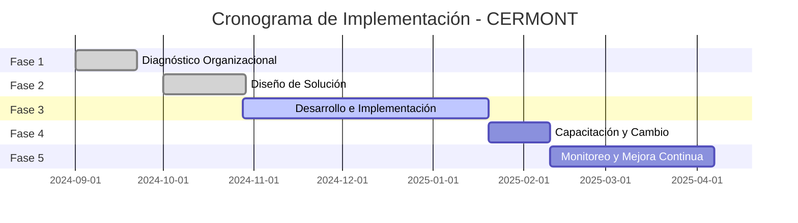
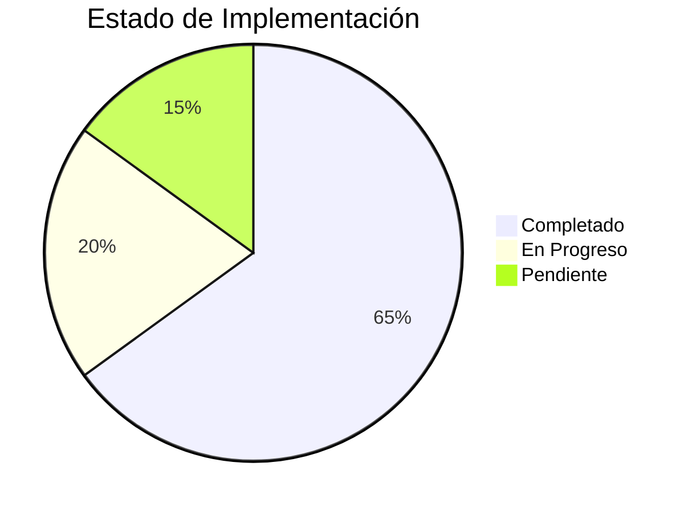

# 📋 ROADMAP DEL PROYECTO - CERMONT S.A.S.

**Sistema de Gestión de Órdenes de Trabajo y Servicios de Campo**

---

## 🎯 Visión General del Proyecto

Implementación de un sistema integral de gestión para optimizar los procesos operativos de CERMONT S.A.S., empresa especializada en servicios técnicos y mantenimiento industrial.

---

## 📅 Cronograma de Fases

---

## 🏁 Fase 1: Diagnóstico Organizacional

**Duración**: 2-3 semanas  
**Estado**: ✅ **COMPLETADA**  
**Período**: Septiembre 2024

### Objetivos Cumplidos

- ✅ Mapeo de procesos actuales de órdenes de trabajo
- ✅ Identificación de puntos de dolor y cuellos de botella
- ✅ Evaluación de infraestructura tecnológica
- ✅ Análisis de necesidades de usuarios (técnicos, supervisores, gerencia)

### Entregables

| Entregable | Estado |
|------------|--------|
| Diagrama de proceso actual (BPMN) | ✅ |
| Matriz de problemas priorizada | ✅ |
| Métricas de línea base | ✅ |
| Inventario tecnológico | ✅ |
| Documento de requisitos preliminares | ✅ |
| Estimación de ROI preliminar | ✅ |

### Hallazgos Clave

1. **Problema principal**: Proceso manual basado en Excel, WhatsApp y papel
2. **Impacto**: Pérdida de información, retrabajos, falta de trazabilidad
3. **Oportunidad**: Digitalización completa del flujo de trabajo
4. **Necesidad crítica**: Sistema offline para zonas sin conectividad

---

## 🎨 Fase 2: Diseño de Solución

**Duración**: 3-4 semanas  
**Estado**: ✅ **COMPLETADA**  
**Período**: Octubre 2024

### Objetivos Cumplidos

- ✅ Adaptación del modelo de sistema para CERMONT
- ✅ Definición de máquina de estados customizada
- ✅ Diseño del modelo de datos completo
- ✅ Definición de arquitectura (Clean Architecture)
- ✅ Diseño de seguridad y control de acceso (RBAC)

### Componentes Diseñados

| Componente | Personalización | Estado |
|------------|-----------------|--------|
| Autenticación (JWT + MFA) | Baja | ✅ |
| Gestión de usuarios | Media | ✅ |
| Catálogo de servicios y kits | Alta | ✅ |
| Máquina de estados | Alta | ✅ |
| Plantillas de documentos | Alta | ✅ |
| Dashboard y reportes | Media | ✅ |
| Captura de evidencias | Baja | ✅ |
| Modo offline | Baja | ✅ |

### Decisiones Técnicas

- **Backend**: Node.js + Express + TypeScript
- **Frontend**: Next.js + React + TypeScript
- **Base de datos**: PostgreSQL
- **ORM**: Prisma
- **Arquitectura**: Clean Architecture (4 capas)
- **Autenticación**: JWT + RBAC
- **Almacenamiento**: Local (dev) / S3 (prod)

### Documentación Generada

- ✅ [FASE_2_DISENO.md](./FASE_2_DISENO.md) - Documento de diseño completo
- ✅ [FASE_2_CHECKLIST.md](./FASE_2_CHECKLIST.md) - Lista de verificación
- ✅ [FASE_2_VALIDACION_TECNICA.md](./FASE_2_VALIDACION_TECNICA.md) - Validación técnica

---

## 💻 Fase 3: Desarrollo e Implementación

**Duración**: 8-12 semanas  
**Estado**: 🔄 **EN PROGRESO** (75% completado)  
**Período**: Octubre 2024 - Enero 2025

### Roadmap de Desarrollo

#### ✅ Semanas 1-2: Configuración del Entorno (COMPLETADO)
- ✅ Provisionar infraestructura cloud
- ✅ Configurar repositorio Git
- ✅ Establecer estructura de proyecto
- ✅ Configurar PostgreSQL

#### ✅ Semanas 3-6: Módulos Core (COMPLETADO)
- ✅ Sistema de autenticación (JWT + MFA)
- ✅ CRUD de órdenes de trabajo
- ✅ Máquina de estados implementada
- ✅ Gestión de usuarios y roles
- ✅ CRUD de planes de trabajo
- ✅ Captura y gestión de evidencias
- ✅ Sistema de kits y equipamiento

#### ✅ Semanas 7-9: Módulos Complementarios (COMPLETADO)
- ✅ Dashboard con métricas
- ✅ Sistema de reportes
- ✅ Generación de PDFs (informes, actas, SES)
- ✅ Sistema de notificaciones
- ✅ Formularios dinámicos
- ✅ Actas de cierre digitales

#### 🔄 Semanas 10-12: Pruebas e Integraciones (EN PROGRESO)
- ✅ Pruebas unitarias (parcial)
- 🔄 Pruebas de integración
- 🔄 UAT (User Acceptance Testing)
- ⏳ Corrección de defectos
- ⏳ Documentación de usuario final

### Módulos Implementados

| Módulo | Estado | Completitud |
|--------|--------|-------------|
| **Autenticación y Autorización** | ✅ | 100% |
| **Gestión de Órdenes** | ✅ | 100% |
| **WorkPlans (Planes de Trabajo)** | ✅ | 100% |
| **Evidencias** | ✅ | 100% |
| **Kits y Equipamiento** | ✅ | 100% |
| **Dashboard** | ✅ | 100% |
| **Reportes y PDFs** | ✅ | 100% |
| **Formularios Dinámicos** | ✅ | 100% |
| **Actas de Cierre** | ✅ | 95% |
| **Sistema de Costos** | ✅ | 90% |
| **Modo Offline** | 🔄 | 70% |
| **Notificaciones** | ✅ | 85% |

### Funcionalidades Avanzadas

- ✅ **Archivado automático** de órdenes antiguas
- ✅ **Sistema de costos** (estimado vs. real)
- ✅ **Facturación integrada** (estados de billing)
- ✅ **Sugerencias automáticas** de kits
- ✅ **Firmas digitales** múltiples
- ✅ **Geolocalización** de evidencias
- ✅ **Versionado** de documentos
- ✅ **Audit log** completo
- ✅ **Security features** (MFA, password policies, account lockout)

---

## 👥 Fase 4: Capacitación y Cambio Organizacional

**Duración**: 2-3 semanas  
**Estado**: ⏳ **PENDIENTE**  
**Período estimado**: Enero-Febrero 2025

### Objetivos

- Capacitar a usuarios por rol (Operarios, Supervisores, Admins)
- Crear materiales de soporte (videos, guías, FAQ)
- Implementar adopción gradual (piloto → expansión → despliegue completo)
- Gestionar el cambio organizacional

### Plan de Capacitación

| Rol | Duración | Contenido |
|-----|----------|-----------|
| **Administradores** | 4 horas | Configuración, gestión de usuarios, reportes avanzados |
| **Supervisores** | 3 horas | Asignación de órdenes, seguimiento, aprobaciones |
| **Técnicos de campo** | 2 horas | Captura de información, modo offline, evidencias |

### Estrategia de Adopción

1. **Semana 1**: Piloto con 2-3 técnicos voluntarios
2. **Semana 2**: Expansión a 50% del equipo
3. **Semana 3+**: Despliegue completo con soporte intensivo

### Materiales a Generar

- ⏳ Videos tutoriales (5 min c/u)
- ⏳ Guías rápidas (tarjetas de bolsillo)
- ⏳ FAQ con problemas comunes
- ⏳ Línea de soporte (primeras 4 semanas)

---

## 📊 Fase 5: Monitoreo y Mejora Continua

**Duración**: Continuo  
**Estado**: ⏳ **PENDIENTE**  
**Inicio estimado**: Febrero 2025

### Objetivos

- Monitorear adopción y uso del sistema
- Medir KPIs y métricas de rendimiento
- Recopilar feedback de usuarios
- Implementar mejoras iterativas

### KPIs a Monitorear

| Métrica | Meta | Frecuencia |
|---------|------|------------|
| Tasa de adopción | > 90% | Semanal |
| Tiempo de ciclo de órdenes | Reducción 40% | Mensual |
| Tasa de errores documentales | < 0.2 por orden | Mensual |
| Satisfacción usuario (SUS) | > 70 | Trimestral |
| Disponibilidad del sistema | > 99.5% | Diario |
| Éxito de sincronización offline | > 95% | Semanal |

### Ciclo de Mejora

- **Mensual**: Revisar métricas y feedback
- **Trimestral**: Evaluar nuevos requerimientos
- **Semestral**: Actualizar sistema con mejoras
- **Anual**: Evaluar ROI, ajustar estrategia

---

## 🔑 Roles y Permisos del Sistema

### Matriz de Roles

| Funcionalidad | OPERARIO | SUPERVISOR | ADMIN | GERENCIA |
|---------------|----------|------------|-------|----------|
| Ver órdenes asignadas | ✅ | ✅ | ✅ | ✅ |
| Crear órdenes | ❌ | ✅ | ✅ | ✅ |
| Ejecutar en campo | ✅ | ✅ | ✅ | ❌ |
| Aprobar plan de trabajo | ❌ | ✅ | ✅ | ✅ |
| Aprobar evidencias | ❌ | ✅ | ✅ | ✅ |
| Ver todos los reportes | ❌ | ❌ | ✅ | ✅ |
| Gestionar usuarios | ❌ | ❌ | ✅ | ❌ |
| Dashboard ejecutivo | ❌ | ❌ | ✅ | ✅ |
| Configurar sistema | ❌ | ❌ | ✅ | ❌ |
| Exportar datos masivos | ❌ | ❌ | ❌ | ✅ |

---

## 🏗️ Stack Tecnológico

### Backend
- **Runtime**: Node.js 18+
- **Framework**: Express.js
- **Lenguaje**: TypeScript
- **ORM**: Prisma
- **Base de datos**: PostgreSQL 15
- **Autenticación**: JWT + Refresh Tokens
- **Seguridad**: bcrypt, MFA (TOTP)

### Frontend
- **Framework**: Next.js 14
- **UI Library**: React 18
- **Lenguaje**: TypeScript
- **Styling**: CSS Modules
- **State**: React Context API
- **Offline**: IndexedDB (Dexie.js)
- **PWA**: Service Workers

### DevOps
- **Containerización**: Docker
- **Orquestación**: Docker Compose
- **CI/CD**: GitHub Actions (planificado)
- **Hosting**: VPS / AWS (configurable)
- **Monitoreo**: Logs + Audit Trail

---

## 📈 Progreso General del Proyecto

### Resumen por Fase

| Fase | Estado | Completitud |
|------|--------|-------------|
| **Fase 1**: Diagnóstico | ✅ COMPLETADA | 100% |
| **Fase 2**: Diseño | ✅ COMPLETADA | 100% |
| **Fase 3**: Desarrollo | 🔄 EN PROGRESO | 75% |
| **Fase 4**: Capacitación | ⏳ PENDIENTE | 0% |
| **Fase 5**: Monitoreo | ⏳ PENDIENTE | 0% |

**Progreso total del proyecto: 65%**

---

## 🎯 Próximos Hitos

### Corto Plazo (1-2 semanas)
1. ⏳ Completar pruebas de integración
2. ⏳ Finalizar modo offline
3. ⏳ UAT con usuarios piloto

### Mediano Plazo (1 mes)
1. ⏳ Despliegue en ambiente de producción
2. ⏳ Capacitación de usuarios
3. ⏳ Inicio de Fase 4

### Largo Plazo (3-6 meses)
1. ⏳ Adopción completa del sistema
2. ⏳ Medición de ROI real
3. ⏳ Ciclo de mejoras continuas

---

## 📚 Recursos y Documentación

### Documentación Técnica
- [ARQUITECTURA.md](./ARQUITECTURA.md) - Arquitectura del sistema
- [DEPLOYMENT.md](./DEPLOYMENT.md) - Guía de despliegue
- [REFACTORING.md](./REFACTORING.md) - Guía de refactorización
- [STATUS.md](./STATUS.md) - Estado actual del proyecto

### Documentación de Diseño (Fase 2)
- [FASE_2_DISENO.md](./FASE_2_DISENO.md) - Diseño completo
- [FASE_2_CHECKLIST.md](./FASE_2_CHECKLIST.md) - Checklist
- [FASE_2_VALIDACION_TECNICA.md](./FASE_2_VALIDACION_TECNICA.md) - Validación

### Documentación Académica
- `../Libro/` - Tesis de grado completa
- `../Libro/Apendices/Apendices.tex` - Guía de replicación

---

## 🤝 Equipo del Proyecto

### Desarrollo
- **Juan Diego Arévalo Pidiache** - Lead Developer & Architect
- **Universidad de Pamplona** - Asesoría académica

### Cliente
- **CERMONT S.A.S.** - Organización beneficiaria
- **Stakeholders**: Gerencia, Supervisores, Técnicos de campo

---

## 📞 Contacto y Soporte

Para consultas sobre el proyecto:

- **Repositorio**: `https://github.com/JuanDiego30/cermont_aplicativo`
- **Licencia**: MIT (uso libre con atribución)

---

**Última actualización**: 2024-11-26  
**Versión del roadmap**: 1.0  
**Estado general**: 🔄 **EN DESARROLLO ACTIVO**
