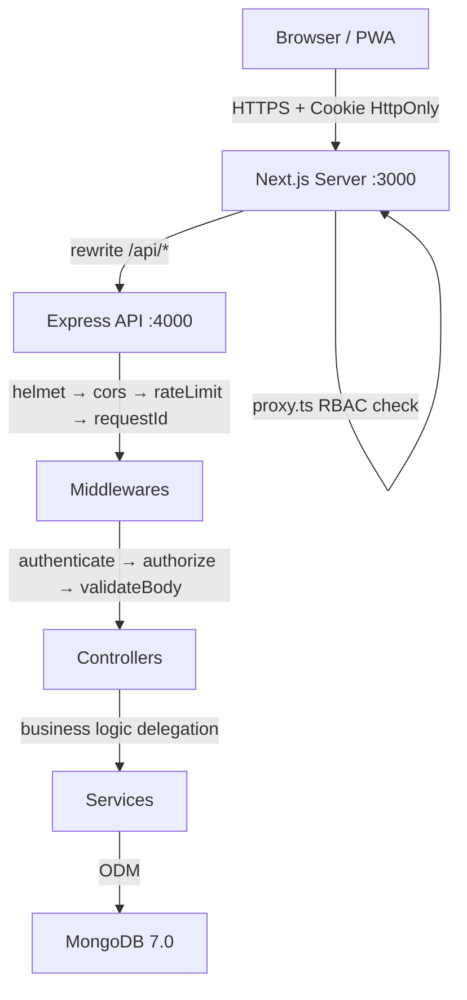
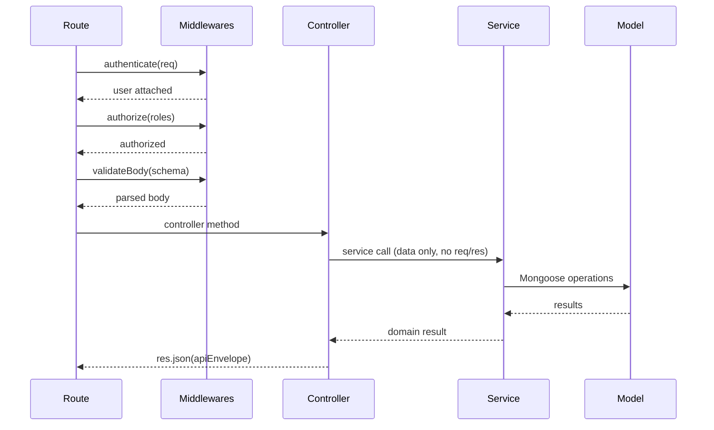
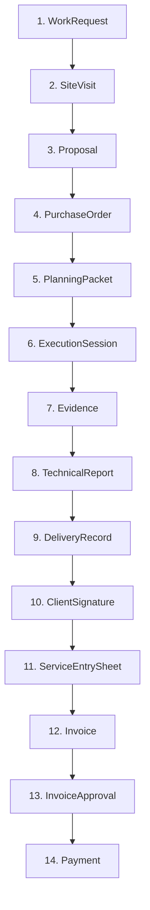
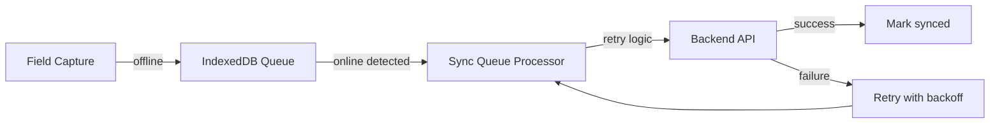
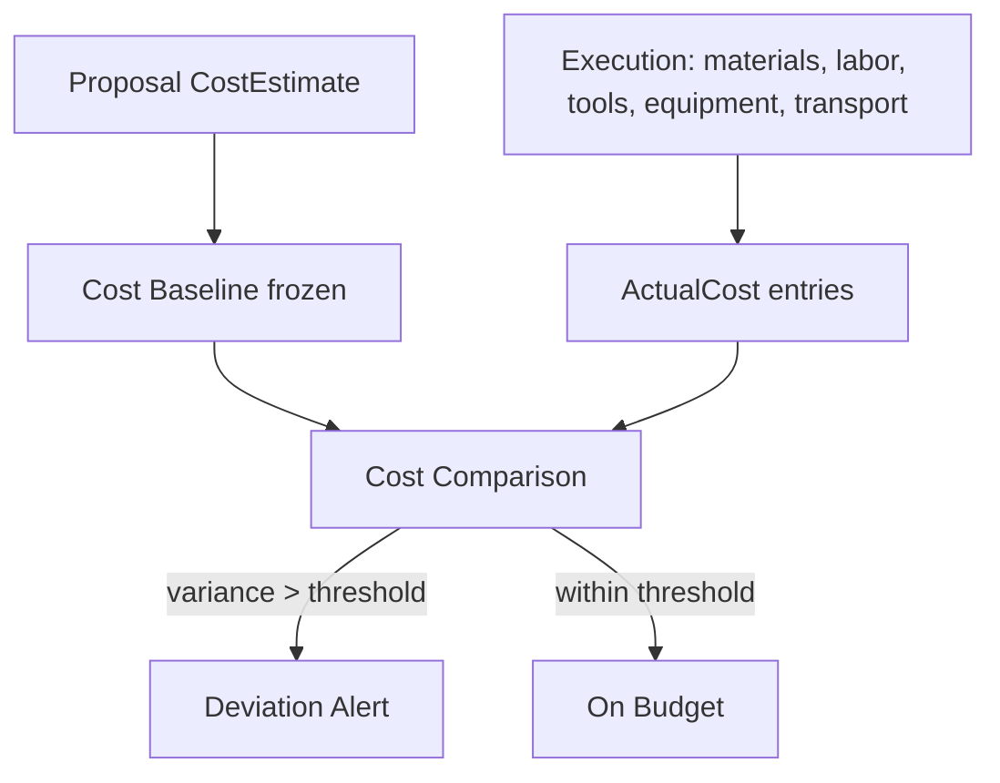
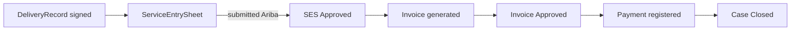
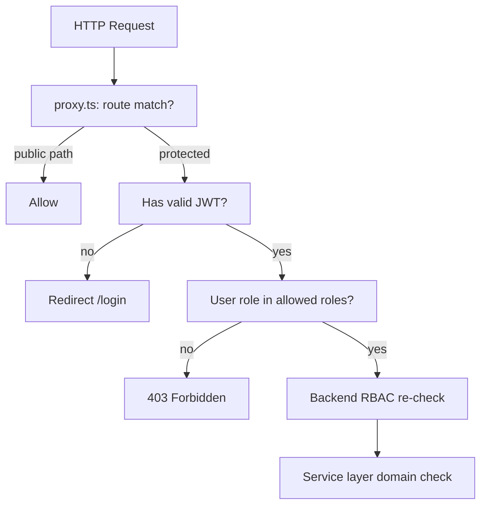
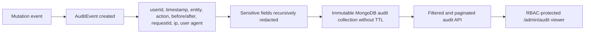

# CERMONT ARCHITECTURE BLUEPRINT

**Date:** 2026-05-13  
**Version:** 1.0 — Canonical  
**Status:** CURRENT_SOURCE_OF_TRUTH  
**Replaces:** DOC-01, DOC-02, DOC-03, DOC-04, DOC-05, DOC-06, DOC-08

---

## 1. Monorepo Structure

```
cermont_aplicativo/
├── backend/                    ← Express 5.2.1 + Mongoose 9.x (workspace: "backend")
│   ├── src/
│   │   ├── config/             ← db.ts (MongoDB IPv4), env validation
│   │   ├── routes/             ← *.routes.ts — endpoint wiring only
│   │   ├── controllers/        ← *.controller.ts — thin HTTP layer
│   │   ├── services/           ← *.service.ts — business logic
│   │   ├── models/             ← Mongoose schemas
│   │   ├── middlewares/        ← auth, validate, rateLimit, requestId
│   │   └── utils/              ← Pure helpers
│   └── package.json
│
├── frontend/                   ← Next.js 16 + React 19 (workspace: "frontend")
│   ├── src/
│   │   ├── app/                ← App Router pages (Server Components default)
│   │   ├── modules/            ← Feature-Sliced Design: orders/, proposals/, etc.
│   │   │   └── {module}/
│   │   │       ├── api/        ← API client functions
│   │   │       ├── hooks/      ← TanStack Query hooks
│   │   │       ├── ui/         ← React components
│   │   │       ├── model/      ← Types, constants
│   │   │       └── utils/      ← Pure helpers
│   │   ├── components/common/  ← Shared UI: Button, Card, Dialog, FormField
│   │   ├── lib/
│   │   │   ├── http/           ← api-client.ts (centralized HTTP)
│   │   │   └── pwa/            ← offline-queue.ts, service-worker registration
│   │   └── store/              ← Zustand stores (auth, queue, UI)
│   ├── proxy.ts                ← Security perimeter (NO middleware.ts)
│   └── next.config.ts          ← Turbopack + rewrites to backend
│
├── packages/
│   ├── shared-types/           ← @cermont/shared-types — Zod schemas, API contracts
│   │   └── src/
│   │       ├── schemas/        ← NEW schemas go here
│   │       └── zod/            ← LEGACY — do not add new code here
│   ├── domain/                 ← @cermont/domain — RBAC roles, permissions, helpers
│   └── config/                 ← @cermont/config — env validation, shared config
│
├── docs/                       ← All documentation (this directory)
├── tooling/                    ← Repo maintenance scripts
├── docker/                     ← Docker configs
└── scripts/                    ← Auxiliary scripts
```

**Workspace definition (root `package.json`):**
```json
"workspaces": ["backend", "frontend", "packages/*"]
```

---

## 2. Technology Stack

### Backend
| Technology | Version | Role |
|-----------|---------|------|
| Node.js | >=22.20.0 | Runtime |
| Express | 5.2.1 | HTTP framework (async native) |
| Mongoose | 9.3.x | MongoDB ODM |
| MongoDB | 7.0 | Database |
| Zod | 4.3.6 | Schema validation |
| jsonwebtoken | 9.0.3 | JWT tokens |
| bcryptjs | 3.0.3 | Password hashing |
| helmet | 8.1.0 | Security headers |
| cors | 2.8.6 | CORS control |
| express-rate-limit | 8.3.1 | Rate limiting |
| multer | 2.1.1 | File upload |
| sharp | 0.34.5 | Image processing |
| pdf-lib | 1.17.1 | PDF generation |
| cookie-parser | 1.4.7 | HttpOnly cookies |

### Frontend
| Technology | Version | Role |
|-----------|---------|------|
| Next.js | 16.2.1 | Framework (App Router + Turbopack) |
| React | 19.2.4 | UI library |
| TypeScript | 5.x (strict) | Language |
| Tailwind CSS | 4.2.2 | Utility-first styles |
| TanStack Query | 5.95.2 | Server state |
| Zustand | 5.0.12 | Client state |
| react-hook-form | 7.72.0 | Form management |
| @hookform/resolvers | 5.2.2 | Zod resolver |
| Radix UI | various | Accessible primitives |
| Framer Motion | 12.38.0 | Animations |
| Recharts | 3.8.1 | Charts |
| lucide-react | 1.7.0 | Icons |
| sonner | 2.0.7 | Toasts |

### Shared
| Package | Role |
|---------|------|
| @cermont/shared-types | Zod schemas, inferred types, API contracts |
| @cermont/domain | RBAC roles, permissions, route access helpers |
| @cermont/config | Shared env validation |

### Testing
| Tool | Role |
|------|------|
| Vitest | Unit + integration tests |
| Playwright | E2E tests |
| Biome | Linting + formatting |

---

## 3. Architecture Diagrams

### 3.1 Request Flow


### 3.2 Backend Layer Sequence


### 3.3 Document-Driven Forms Pipeline

```mermaid
graph LR
    U[Upload PDF/Excel/Word/Photos] --> I[DocumentImport]
    I --> P[Parser: text, tables, fields]
    P --> D[Detection: field types, checklists, signatures]
    D --> R[Human Review UI]
    R --> T[DocumentTemplate versioned]
    T --> F[DynamicForm generated]
    F --> C[Field Capture online/offline]
    C --> G[GeneratedDocument: PDF report/acta]
```


### 3.4 ServiceCase 14-Step Lifecycle


### 3.5 Offline Outbox Pattern


### 3.6 Cost Engine


### 3.7 Administrative Closure


### 3.8 RBAC Flow


### 3.9 Audit Flow


---

## 4. Contract-First Development

Every feature must follow this order:

```
1. Zod schema in packages/shared-types/src/schemas/
2. Inferred type from Zod
3. Mongoose model aligned with schema
4. Backend service (business logic)
5. Thin controller (req → service → res)
6. Route with validation middleware
7. Frontend API client function
8. Stable query keys
9. TanStack Query hook
10. UI component
11. Tests (unit + E2E)
```

---

## 5. Feature-Sliced Design (Frontend)

Each business module in `frontend/src/modules/{module}/` contains:

```
{module}/
├── api/        ← apiClient calls (e.g., orders.api.ts)
├── hooks/      ← TanStack Query hooks (e.g., useOrders.ts)
├── ui/         ← React components
├── model/      ← Types, constants, query keys
└── utils/      ← Pure helpers
```

**Valid modules:** work-requests, proposals, orders, planning, field-execution, evidences, costs, reports, service-entry-sheets, invoices, payments, documents, document-templates, assets, maintenance, billing, users, dashboard

---

## 6. API Conventions

### 6.1 Base URL
Backend exposes: `http://127.0.0.1:4000/api`
Frontend proxy rewrites: `/api/*` → `http://127.0.0.1:4000/api/*`

### 6.2 Response Envelope
```typescript
// Success
{ "success": true, "data": T, "message"?: string }

// Error
{ "success": false, "error": { "code": "ERROR_CODE", "message": "string" } }

// Paginated
{ "success": true, "data": T[], "pagination": { "page": number, "limit": number, "total": number, "totalPages": number } }
```

### 6.3 Route Middleware Order
```
authenticate → authorize(roles?) → validateBody/validateQuery/validateParams → controller
```

---

## 7. RBAC — 8 Roles

| Role | Scope |
|------|-------|
| `gerente` | Full access, approvals, executive reports |
| `residente` | Order management, resource assignment |
| `HES` | Safety coordination, SGSST inspections |
| `supervisor` | Team supervision, execution validation |
| `operador` | Field task execution |
| `tecnico` | Specialized execution, technical reports |
| `administrativo` | Billing, administrative closure |
| `cliente` | Read-only own orders, approvals |

**SSOT:** `@cermont/domain` — never hardcode role strings.

---

## 8. Offline-First Architecture

- **Storage:** `CermontOfflineDB` (Dexie) for responses, snapshots, photos and signatures
- **Queue:** `offlineOutbox` is the only mutation queue; legacy stores are migration sources only
- **Sync:** Automatic on connectivity restore; manual retry available
- **Conflict:** Explicit conflict resolution (no silent overwrites)
- **DLQ:** Failed mutations and binary uploads remain local until retry or explicit discard
- **UI:** Global banner/chip plus `/offline-sync` recovery center for failed and conflicted items
- **Service Worker:** `/serwist/sw.js`; NetworkOnly for auth, `/api/*` and `/uploads/*`
- **Worker timing:** Custom `message` and protected-request `fetch` listeners register before Serwist handlers
- **Recovery:** Never delete IndexedDB automatically when pending data may exist
- **Retry scheduling:** Persist `nextRetryAt`, honor `Retry-After`, and trigger a future sweep without requiring another network event

---

## 9. Security by Design (Defense in Depth)

```
Layer 1: proxy.ts — route protection, public path exemptions
Layer 2: Sidebar — role-filtered navigation
Layer 3: Backend RBAC — authenticate → authorize middleware
Layer 4: Service layer — domain validation
Layer 5: Database — indexes, constraints, tenant query isolation
Layer 6: Audit log — all mutations recorded
```

### 9.1 Authentication and Sessions

- Access tokens expire after 15 minutes.
- Refresh tokens expire after 7 days and rotate on every successful refresh.
- MongoDB stores only the refresh-token hash, `jti`, family, expiration, state, and user token version.
- Reuse of a rotated/revoked refresh token compromises the family and increments `User.tokenVersion`.
- Password changes revoke active refresh sessions and invalidate prior access-token versions.

### 9.2 HTTP and Resource Protection

- Production CORS accepts only `FRONTEND_URL`; development additionally accepts local/private origins.
- Helmet applies CSP, `nosniff`, frame denial, and no-referrer policy.
- Limits: credentials 5/minute, uploads 10/minute, general API 100/15 minutes.
- Production rate-limit counters use MongoDB; in-memory counters are test/development only.
- Uploads use UUID storage names, verified MIME signatures, optional ClamAV scanning, and a 20 MB limit.
- Evidence access is derived from work-order ownership/assignment/supervision. Client portal order detail verifies `clientId`/`createdBy` and returns `TENANT_ACCESS_DENIED` on cross-client access.
- The tenant query plugin is applied only to models with a real `clientId`; linked artifacts use their owning order or service case as the authorization root.

---

## 10. Data Integrity

- **Soft delete:** Document and evidence queries exclude records with `lifecycleStatus: "deleted"` through a shared Mongoose plugin. Physical files are preserved for auditability.
- **Retention:** Signed, template-source, and closing documents are archived for five years instead of deleted.
- **Closure locks:** Service cases in `paid`, `archived`, or `cancelled` stages reject step submissions, evidence uploads, and workflow advancement.
- **Evidence references:** Contextual evidence verifies that `workOrderId` and `executionSessionId` are canonical artifacts of the selected service case.
- **Server calculations:** Proposal item totals, subtotal, tax, and total are recalculated on creation, approval, and order conversion.
- **Billing consistency:** Invoice creation uses SES-owned values; submission and approval revalidate identifiers, currency, totals, and line items against the approved SES.
- **Configuration:** Backend startup validates required MongoDB, JWT, refresh-token, and frontend-origin variables with Zod and fails fast.

---

## 11. Observability

- **requestId middleware** — validates a safe upstream identifier or creates a UUID, propagating it to responses, request context, logs, and audit events
- **Structured logs** — production JSON with levels, error serialization, and recursive secret redaction
- **Health checks** — `/api/health/live` for liveness, `/api/health/ready` for MongoDB readiness, and `/api/health` as a compatibility readiness endpoint
- **Rate-limit isolation** — health/session recovery bypass the ordinary API bucket; login/password recovery retain a dedicated limiter
- **Audit events** — immutable, indexed, non-expiring records for critical mutations and all 14 workflow steps, queryable at `/admin/audit`
- **Error codes** — stable typed errors, not text-only messages

---

## 12. Testing Strategy

| Level | Tool | Scope |
|-------|------|-------|
| Unit | Vitest | Services, utils, hooks |
| Integration | Vitest | API endpoints, DB operations |
| Component | Vitest + Testing Library | UI components |
| E2E | Playwright | Critical flows (14 steps, auth, RBAC, offline) |
| Visual | Playwright screenshots | UI regressions |

**Critical flows requiring E2E:** Auth, WorkRequest, Proposal→Order, Planning, Field Execution, Evidence, Costs, Reports, Delivery Records, SES, Invoice, Payment, RBAC, Offline sync.

---

## 13. CI/CD

```bash
npm run typecheck   # TypeScript strict all workspaces
npm run lint        # Biome all workspaces
npm run build       # shared-types → backend → frontend
npm run test        # Vitest all workspaces
npm run test:e2e -w frontend  # Playwright critical paths
npm audit           # Security check
```

---

## 14. Deployment (VPS Only)

- Docker Compose for local dev
- VPS deployment via Docker + nginx reverse proxy
- MongoDB with IPv4 (`family: 4`, `127.0.0.1`)
- No Vercel, no platform lock-in
- Environment-specific `.env` files

---

## 15. Prohibited Technologies

- ❌ NestJS → Express 5.2.1 only
- ❌ Prisma → Mongoose 9.x only
- ❌ PostgreSQL → MongoDB only
- ❌ Auth.js/NextAuth → JWT direct + Zustand
- ❌ pnpm/yarn → npm only
- ❌ middleware.ts → proxy.ts only
- ❌ Joi → Zod 4.x only
- ❌ Axios → api-client.ts (fetch wrapper)
