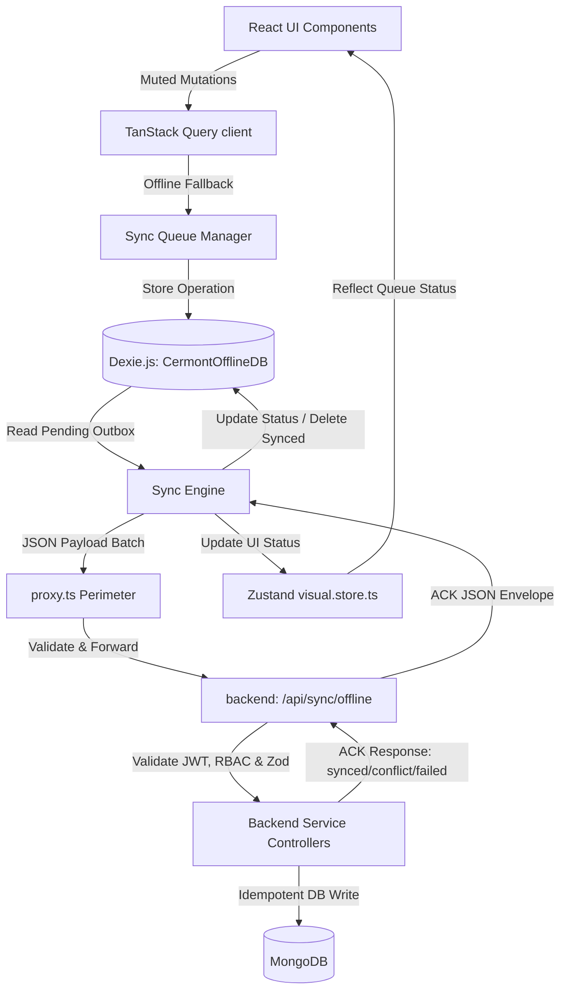
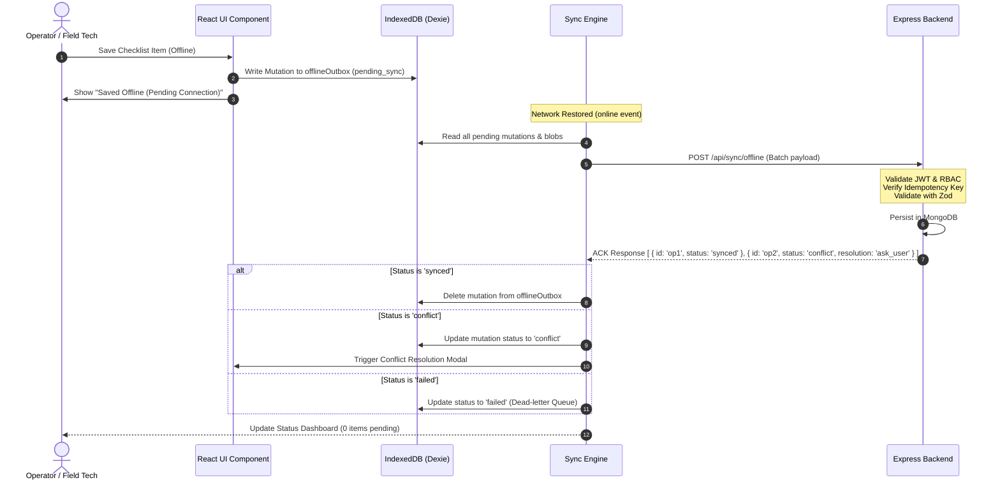

# PWA Offline Flow Map — Cermont S.A.S.

This document outlines the offline-first sync architecture, detailing how the Progress Web App (PWA) client queue, storage, connection manager, synchronization engine, and backend interact.

---

## 1. Offline Architecture Overview

---

## 2. Key Components

### A. PWA Service Worker (`frontend/src/app/sw.ts` & Serwist)
- Automatically generated as `/serwist/sw.js` via Serwist v9.
- Caches public static assets, fonts, layouts, and pages (App Shell).
- Explicitly ignores API routes (`/api/*`), Auth endpoints, and dynamic private data to maintain security.

### B. Local Database Client (`CermontOfflineDB` via Dexie)
IndexedDB acts as the local single source of truth for offline data, containing tables:
- `offlineOutbox`: JSON mutation outbox payloads with status (`pending`, `synced`, `failed`, `conflict`), timestamp, and an `idempotencyKey`.
- `blobOutbox`: Binary blobs (photos, PDF files, signatures) stored locally before network upload.
- `cachedQueries`: Persisted TanStack Query server responses (read-only fallbacks).
- `syncLogs`: Trace logs for audits and diagnostics.

### C. Sync Engine (`frontend/src/lib/offline/sync-engine.ts`)
- Monitors connection events (`window.addEventListener('online')`) and schedules backoff retries.
- Bundles pending mutations into a single optimized payload.
- Dispatches batches to `/api/sync/offline`.
- Processes itemized ACKs (Acknowledge Envelopes) from the backend.

---

## 3. Synchronization Flow (Step-by-Step)

---

## 4. Media & Binary Offline Queue (`blob-outbox.ts`)
1. **Local Capture**: Photos taken offline are compressed as WebP and stored as binary `Blob` format in `CermontOfflineDB.blobOutbox` using a UUID reference.
2. **JSON Correlation**: The main entity mutation in `offlineOutbox` points to this UUID as its media reference.
3. **Sequence of Upload**:
   - First, the sync engine processes the `blobOutbox` by sending binary files to `/api/files/offline-upload`.
   - Once all blobs are uploaded and the backend returns the canonical FileAsset URL/ID, the sync engine updates the JSON mutation in the outbox.
   - Finally, the JSON mutation is synced with real database IDs, avoiding orphan references.

---

## 5. Security & Isolation Constraints

- **No Secret Storage**: JWT tokens and passwords are never written to IndexedDB. They remain in memory.
- **Strict Authorization**: Synchronizing a batch requires an active, authenticated session. If the token expires during sync, the queue halts and initiates a silent token refresh.
- **Idempotency Safeguard**: Every queued action has a unique UUID. The backend retains a log of executed idempotency keys for 24 hours to prevent duplicate data insertion (e.g., creating the same proposal twice).
