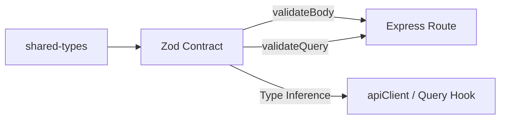

# CAVERNICOLA API CONTRACT MAP — Cermont S.A.S.

## 1. Single Source of Truth Contracts

Contracts are defined in `packages/shared-types/src/schemas/` and validated at route entry gates on both the frontend and the backend.

---

## 2. API Contract Inventory

| Workspace / Module | Route Prefix | HTTP Method | Zod Input Schema | Zod Response Schema | RBAC Role Gate |
|--------------------|--------------|-------------|------------------|---------------------|----------------|
| **Auth** | `/api/auth/login` | `POST` | `LoginInputSchema` | `LoginResponseSchema` | Public |
| **Auth** | `/api/auth/register` | `POST` | `RegisterInputSchema` | `RegisterResponseSchema` | Public |
| **WorkRequest** | `/api/work-requests` | `GET` | `WorkRequestQuerySchema` | `WorkRequestListSchema` | All Auth |
| **WorkRequest** | `/api/work-requests` | `POST` | `CreateWorkRequestSchema` | `WorkRequestDetailSchema` | gerente, residente, HES, cliente |
| **SiteVisit** | `/api/site-visits` | `GET` | `ListSiteVisitsQuerySchema` | `SiteVisitListSchema` | All Auth |
| **SiteVisit** | `/api/site-visits` | `POST` | `CreateSiteVisitSchema` | `SiteVisitDetailSchema` | gerente, residente, HES, supervisor |
| **Proposal** | `/api/proposals` | `GET` | `ListProposalsQuerySchema` | `ProposalListSchema` | All Auth |
| **Proposal** | `/api/proposals` | `POST` | `CreateProposalSchema` | `ProposalDetailSchema` | gerente, residente, HES |
| **Order** | `/api/orders` | `GET` | `ListOrdersQuerySchema` | `OrderListSchema` | All Auth |
| **Order** | `/api/orders` | `POST` | `CreateOrderSchema` | `OrderDetailSchema` | gerente, residente, HES |
| **Files** | `/api/files/upload` | `POST` | `FileAssetUploadInputFormSchema` | `FileAssetUploadResponseSchema` | All Auth |
| **Files** | `/api/files/:id` | `GET` | `FileAssetIdParamsSchema` | `FileAssetRefSchema` | All Auth |
| **Files** | `/api/files/:id` | `DELETE` | `FileAssetIdParamsSchema` | `SuccessResponseSchema` | All Auth |
| **DeliveryRecord** | `/api/delivery-records` | `GET` | `ListDeliveryRecordsQuerySchema` | `ListDeliveryRecordsResponse` | All Auth |
| **DeliveryRecord** | `/api/delivery-records/from-technical-report/:id` | `POST` | `CreateDeliveryRecordV2Schema` | `DeliveryRecordDetail` | gerente, residente, administrativo |
| **DeliveryRecord** | `/api/delivery-records/:id/send` | `POST` | `SendDeliveryRecordSchema` | `DeliveryRecordDetail` | gerente, residente, administrativo |
| **DeliveryRecord** | `/api/delivery-records/:id/sign` | `POST` | `SignDeliveryRecordSchema` | `DeliveryRecordDetail` | gerente, residente, administrativo, cliente |
| **DeliveryRecord** | `/api/delivery-records/:id/reject` | `POST` | `RejectDeliveryRecordSchema` | `DeliveryRecordDetail` | gerente, residente, cliente |
| **DeliveryRecord** | `/api/delivery-records/:id/cancel` | `POST` | None | `DeliveryRecordDetail` | gerente, residente |

---

## 3. Double Validation Strategy (Zero-Trust)

To enforce the **Zero-Trust concentric perimeter**:
1.  **Frontend Validation**: Inputs are parsed using Zod schemas inside `react-hook-form` components (UX feedback).
2.  **Network Boundary**: The API client forces requests to match the defined contracts, and the backend routing layer intercepts and validates body/query/params using the `validateBody`, `validateQuery`, and `validateParams` Express middlewares before invoking the service layer.
3.  **Database Persistence**: Mongoose schemas enforce referential integrity and document limits before saving to MongoDB.
