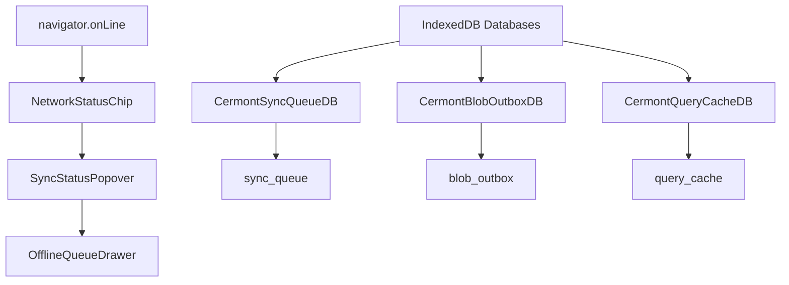

# CAVERNICOLA OFFLINE & INDEXEDDB MAP — Cermont S.A.S.

## 1. Structured Offline Storage Entities

This catalog describes all local databases and stores maintained by the PWA to support resilient field service operations in low-connectivity sectors.



---

## 2. Databases & Object Stores

### A. Sync Queue Database
*   **Database Name:** `CermontSyncQueueDB`
*   **Version:** `1`
*   **Object Store:** `sync_queue` (KeyPath: `id`)
*   **Indices:**
    *   `status` (non-unique)
    *   `dedupeKey` (non-unique)
    *   `nextRetryAt` (non-unique)
*   **Payload Schema (`SyncQueueEntry`):**
    ```typescript
    interface SyncQueueEntry {
      id: string;              // Client-generated UUID
      endpoint: string;        // REST endpoint (e.g. "/evidences")
      method: "POST" | "PATCH" | "PUT" | "DELETE";
      payload: Record<string, unknown>; // JSON payload
      createdAt: number;       // Timestamp
      retryCount: number;
      idempotencyKey: string;  // Essential to prevent server duplicates
      status?: "pending" | "dead_letter";
      nextRetryAt?: number;
      lastError?: string;
      dedupeKey?: string;      // Prevents queueing duplicate changes
    }
    ```

### B. Binary Blob Outbox Database
*   **Database Name:** `CermontBlobOutboxDB`
*   **Version:** `1`
*   **Object Store:** `blob_outbox` (KeyPath: `id`)
*   **Indices:**
    *   `status` (non-unique)
    *   `entityType_entityId` (composite index, non-unique)
    *   `createdAt` (non-unique)
*   **Payload Schema (`BlobOutboxEntry`):**
    ```typescript
    interface BlobOutboxEntry {
      id: string;              // Client-generated ID (blob-timestamp-rand)
      blob: Blob;              // Binary file bytes (PNG, JPEG, WebP, PDF)
      originalName: string;
      mimeType: string;
      sizeBytes: number;
      entityType: string;      // "evidence", "kit", "delivery_record", "technical_report"
      entityId: string;        // Target MongoDB ID
      category: string;        // e.g. "evidence_photo", "signature_image"
      description?: string;
      tags?: string[];
      clientMutationId: string; // Idempotency key for file upload retry
      createdAt: number;
      retryCount: number;
      status: "pending" | "in_flight" | "dead_letter";
      lastError?: string;
    }
    ```

### C. Query Cache Persistence
*   **Database Name:** `CermontQueryCacheDB` (from `@/lib/pwa/query-persist`)
*   **Version:** `1`
*   **Object Store:** `query_cache` (KeyPath: `key`)
*   **Purpose:** Persists TanStack Query's server states so that when a user logs in online and then goes offline, their previously fetched active orders, proposals, and checklists remain completely populated and readable in the UI without throwing network errors.

---

## 3. Service Worker Cache Policies

The Service Worker (`frontend/public/service-worker.js`) governs network interception:
*   **App Shell Caching:** Caches static Next.js assets (`/_next/static/` and `/static/`), fonts, and UI icons.
*   **Dynamic Cache (Stale-While-Revalidate):** Used for non-sensitive pages.
*   **Authentication Boundary:**
    *   ❌ Caching is strictly **BANNED** for `/api/auth`, `/api/backend/auth`, or any token/cookie pathways.
    *   Authentication is required online; no offline login is allowed.
    *   Sensitive tokens are **NEVER** persisted to IndexedDB or localStorage.
