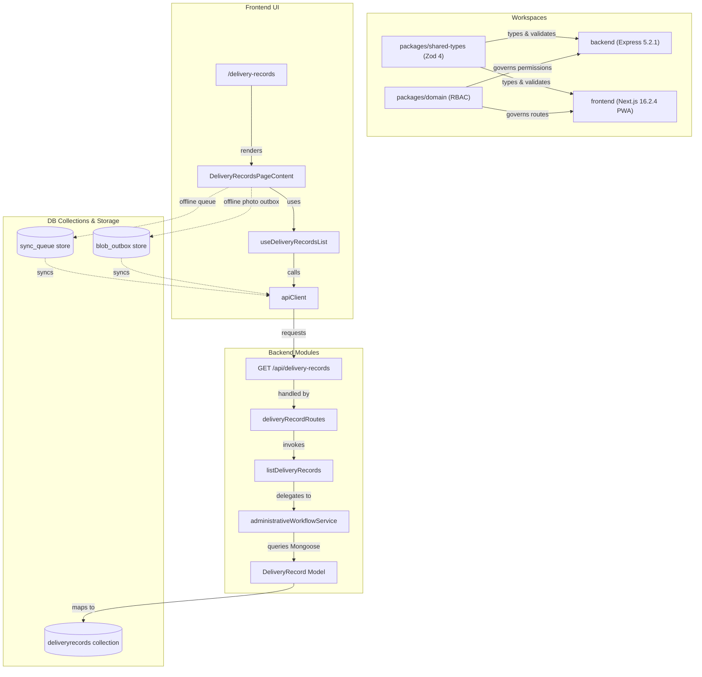

# CAVERNICOLA REPO GRAPH — Cermont S.A.S.

## 1. System Architecture Diagram

This diagram displays the complete network of workspaces, shared contracts, Mongoose collections, API paths, and React query hooks mapping the 14-step Cermont S.A.S. operational lifecycle.

---

## 2. Relationships Table

| Source Node | Relation | Target Node | Context / Details |
|-------------|----------|-------------|-------------------|
| `workspace.shared-types` | validates | `backend.route.deliveryRecord` | Validates query strings and request bodies at network entry. |
| `frontend.route.deliveryRecords` | renders | `frontend.component.DeliveryRecordsPageContent` | Direct React page component. |
| `frontend.component.DeliveryRecordsPageContent` | uses | `frontend.hook.useDeliveryRecordsList` | Hook manages TanStack Query state. |
| `frontend.hook.useDeliveryRecordsList` | calls | `frontend.apiClient` | Sends authenticated AJAX GET request. |
| `frontend.apiClient` | requests | `backend.route.deliveryRecord` | Endpoint URL `/api/delivery-records`. |
| `backend.route.deliveryRecord` | invokes | `backend.controller.WorkflowController.listDeliveryRecords` | Handles route parameters. |
| `backend.controller.WorkflowController.listDeliveryRecords` | delegates | `backend.service.administrativeWorkflow` | Invokes transactional business logic. |
| `backend.service.administrativeWorkflow` | queries | `backend.model.DeliveryRecord` | Retreives data from MongoDB. |
| `backend.model.DeliveryRecord` | maps to | `mongodb.collection.deliveryrecords` | Underneath Mongoose collection structure. |

---

## 3. Visual & Architectural Integrity

Every visual modification (Stitch proposal) and every schema extension (FileAssetRef) must be mapped to this graph before implementation. The graph acts as the repo's single source of truth for traceability.
