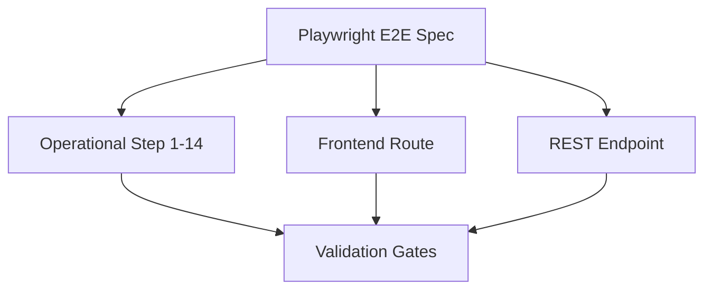

# CAVERNICOLA E2E TRACEABILITY MATRIX — Cermont S.A.S.

## 1. Test-to-Flow Mapping

This matrix establishes complete traceability from automated Playwright/Vitest specs in `frontend/tests/` to the 14-step operational pipeline of Cermont S.A.S.

---

## 2. Traceability Matrix

| Test File Name | Target Business Step | Target Route | Target Backend Endpoint | Zod Contract Verified | Persistency Checked |
|----------------|----------------------|--------------|-------------------------|------------------------|---------------------|
| `auth.spec.ts` | Base Auth | `/login` | `POST /api/auth/login` | `LoginInputSchema` | Cookie HttpOnly JWT |
| `navigation.spec.ts`| Core Navigation | `/dashboard` | `GET /api/dashboard` | `DashboardSummary` | Server State |
| `site-visits.spec.ts`| Paso 2 - Visita técnica | `/site-visits` | `POST /api/site-visits`| `CreateSiteVisitSchema`| SiteVisit Mongoose |
| `proposals.spec.ts`| Paso 3 - Propuesta | `/proposals` | `POST /api/proposals` | `CreateProposalSchema` | Proposal Mongoose |
| `orders.spec.ts` | Paso 5 - Planeación | `/orders` | `POST /api/orders` | `CreateOrderSchema` | Order Mongoose |
| `evidence.spec.ts` | Paso 6 - Evidencias | `/orders/[id]/evidences`| `POST /api/files/upload`| `FileAssetUploadForm` | Evidence/FileAsset |
| `delivery-records.spec.ts`| Pasos 8-9 - Acta y Firma| `/delivery-records` | `POST /api/delivery-records`| `SignDeliveryRecord` | DeliveryRecord |
| `ses.spec.ts` | Pasos 10-11 - SES Ariba | `/billing/ses` | `POST /api/ses` | `SubmitServiceEntrySheet`| ServiceEntrySheet |
| `invoices.spec.ts` | Pasos 12-13 - Facturación| `/billing/invoices` | `POST /api/invoices` | `CreateOrderInvoice` | Invoice Mongoose |
| `payments.spec.ts` | Paso 14 - Cierre Pago | `/payments` | `POST /api/payments` | `RegisterInvoicePayment`| Payment Mongoose |
| `offline-sync.spec.ts`| Offline & Synchronization| `/delivery-records` | `POST /api/sync` | `SyncInputSchema` | IndexedDB Outbox |

---

## 3. Playwright E2E Verification Rule

All E2E tests executing in the CI environment must satisfy these conditions:
1.  **Idempotent Seeds**: Database state must be clean before each suite run (using `npx tsx backend/src/scripts/seed.ts`).
2.  **No Mocks in Production Specs**: Must test real communication between Next.js frontend, Express proxy, and local MongoDB.
3.  **Screenshot/Trace Capture**: Fails must generate Playwright traces and screenshots in `test-results/` for immediate debugging.
