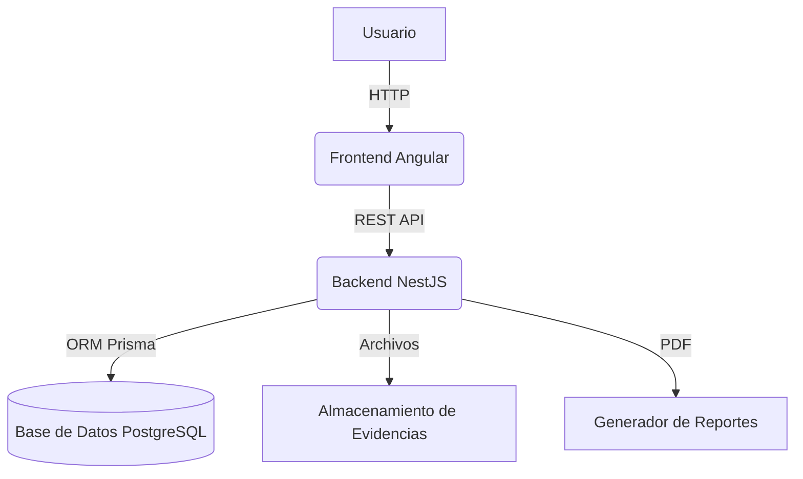
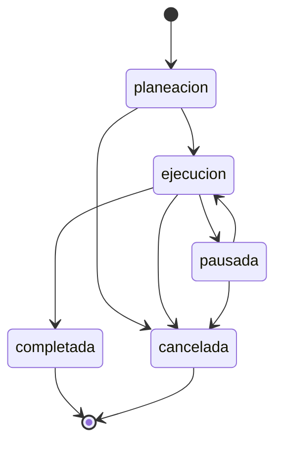

## Diagramas de Arquitectura y Flujo

### Diagrama General de Arquitectura


### Diagrama de Estados de Orden


## Ejemplo Avanzado: Flujo Completo de una Orden

1. **Creación:** Un usuario crea una orden desde el frontend, que se registra con estado `planeacion`.
2. **Planeación:** Se asocian kits y se planifica la ejecución.
3. **Ejecución:** Un técnico inicia la ejecución, se registran tareas, evidencias y costos.
4. **Finalización:** Al completar, la orden pasa a estado `completada` y se genera un reporte PDF.
5. **Auditoría:** Todos los cambios quedan registrados en el historial y logs de auditoría.

## Capítulo Extra: Seguridad y Buenas Prácticas

- **Autenticación:** JWT, refresh tokens, OAuth Google, roles y permisos (RBAC).
- **Validación:** DTOs validados con Zod y class-validator.
- **Hash de contraseñas:** Bcrypt con 12 rounds.
- **Auditoría:** Logging de acciones críticas y cambios de estado.
- **Pruebas:** Unitarias, integración y E2E automatizadas.
- **CI/CD:** Despliegue automatizado y chequeos de calidad.

## Capítulo Extra: Escalabilidad y Mantenimiento

- **Monorepo:** Facilita la gestión de dependencias y la integración entre backend y frontend.
- **Modularidad:** Cada módulo es independiente y fácilmente ampliable.
- **Documentación:** Código auto-documentado y OpenAPI/Swagger para la API.
- **Monitorización:** Soporte para logs centralizados y métricas de salud.

## Capítulo Extra: Casos de Uso Reales y Extensiones

- **Integración con sistemas externos:** API REST lista para integrarse con ERPs, CRMs o apps móviles.
- **Personalización de reportes:** Plantillas de PDF editables y generación dinámica.
- **Internacionalización:** Soporte para múltiples idiomas en frontend y backend.
- **Accesibilidad:** Interfaz accesible y compatible con lectores de pantalla.

---

> **Este libro puede seguir ampliándose con diagramas UML, ejemplos de migraciones, scripts de pruebas, y cualquier detalle técnico o funcional que requiera el equipo.**
## Resumen de Módulos Principales y Casos de Uso

### Módulo Órdenes
- Gestión de órdenes de trabajo con estados (planeación, ejecución, pausada, completada, cancelada).
- Casos de uso: crear, listar, actualizar, cambiar estado, asignar técnico, obtener historial.
- Arquitectura DDD: entidades, value objects, casos de uso, controladores y repositorios.

### Módulo Planeación
- Permite planificar y aprobar órdenes, asociar kits y gestionar el flujo de aprobación.
- Endpoints: crear planeación, aprobar/rechazar, obtener planeación por orden.

### Módulo Kits
- Gestión de plantillas de herramientas y equipos para trabajos específicos.
- Casos de uso: crear, actualizar, eliminar, agregar/quitar items, activar/desactivar.

### Módulo Ejecución
- Seguimiento de la ejecución de órdenes, registro de tareas, cálculo de avance y geolocalización.
- Endpoints: iniciar/finalizar ejecución, obtener ejecución por orden.

### Módulo Dashboard
- Métricas y KPIs en tiempo real, estadísticas de órdenes, usuarios y costos.

### Módulo Admin
- Gestión de usuarios, roles y configuración del sistema (RBAC).

### Módulo Auth
- Autenticación JWT, refresh tokens, OAuth (Google), logging de auditoría.

### Casos de Uso Destacados
- **Crear Orden:** Permite registrar una nueva orden con número automático y estado inicial.
- **Cambiar Estado:** Valida transiciones y registra historial de cambios.
- **Asignar Técnico:** Asigna responsable y puede iniciar ejecución automáticamente.
- **Generar Reporte PDF:** Permite exportar información de órdenes y mantenimientos en PDF.

Cada módulo está documentado y probado, siguiendo buenas prácticas de ingeniería de software.
## Arquitectura General y Base de Datos

### Arquitectura General
El aplicativo Cermont sigue una arquitectura de monorepo, separando claramente los módulos de backend (`api`) y frontend (`web`). Utiliza pnpm para la gestión de paquetes y TurboRepo para la orquestación de tareas. El backend está construido con NestJS y el frontend con Angular + Tailwind CSS.

### Base de Datos: Diseño e Implementación
La base de datos está modelada en Prisma y utiliza PostgreSQL. El esquema es modular y abarca entidades como `User`, `Order`, `OrderItem`, `Evidence`, `Cost`, entre otras.

#### Ejemplo de Modelo Prisma para Órdenes
```prisma
model Order {
  id           String      @id @default(uuid())
  numero       String      @unique
  descripcion  String
  cliente      String
  estado       OrderStatus @default(planeacion)
  prioridad    OrderPriority @default(media)
  asignadoId   String?
  asignado     User?       @relation("OrderAssignee", fields: [asignadoId], references: [id], onDelete: SetNull)
  items        OrderItem[]
  evidencias   Evidence[]
  costos       Cost[]
  createdAt    DateTime    @default(now())
  updatedAt    DateTime    @updatedAt
  @@map("orders")
}

model User {
  id       String   @id @default(uuid())
  email    String   @unique
  password String?
  name     String
  role     UserRole @default(tecnico)
  ordenes  Order[]  @relation("OrderCreator")
  asignaciones Order[] @relation("OrderAssignee")
  createdAt DateTime @default(now())
  updatedAt DateTime @updatedAt
  @@map("users")
}
```

#### Ejemplo de Seed de Base de Datos
```typescript
// apps/api/prisma/seed.ts
const admin = await prisma.user.upsert({
  where: { email: 'root@cermont.com' },
  update: { ... },
  create: {
    email: 'root@cermont.com',
    password: hashedPassword,
    name: 'Administrador',
    role: 'admin',
    phone: faker.phone.number(),
    active: true,
  },
});
```

### Despliegue Docker
El backend y frontend pueden desplegarse en contenedores Docker. El Dockerfile del backend utiliza multi-stage build para optimizar la imagen y seguridad.

#### Ejemplo de Dockerfile Backend
```dockerfile
FROM node:20-alpine AS builder
WORKDIR /app
RUN npm install -g pnpm
COPY package.json pnpm-lock.yaml ./
COPY prisma ./prisma
RUN pnpm install --frozen-lockfile
RUN pnpm prisma generate
COPY . .
RUN pnpm run build

FROM node:20-alpine AS production
WORKDIR /app
RUN npm install -g pnpm
RUN addgroup -g 1001 -S nodejs && adduser -S nestjs -u 1001
COPY --from=builder --chown=nestjs:nodejs /app/dist ./dist
COPY --from=builder --chown=nestjs:nodejs /app/node_modules ./node_modules
COPY --from=builder --chown=nestjs:nodejs /app/package.json ./
COPY --from=builder --chown=nestjs:nodejs /app/prisma ./prisma
USER nestjs
EXPOSE 4000
HEALTHCHECK --interval=30s --timeout=10s --start-period=5s --retries=3 \
    CMD node -e "require('http').get('http://localhost:4000/api/health', (r) => process.exit(r.statusCode === 200 ? 0 : 1))"
CMD ["node", "dist/main.js"]
```
## Ejemplos de Integración Frontend-Backend y Generación de PDF

### Consumo de API desde Angular
```typescript
// Listar órdenes con filtros
this.ordenesService.list({ page: 1, limit: 10, estado: OrderEstado.EJECUCION, search: 'torre' })
  .subscribe(data => {
    console.log(data);
  });

// Cambiar estado de una orden
this.ordenesService.changeEstado(ordenId, {
  nuevoEstado: OrderEstado.COMPLETADA,
  motivo: 'Trabajo completado exitosamente'
}).subscribe(orden => {
  console.log('Estado cambiado:', orden);
});
```

### Generación y Descarga de PDF desde el Frontend
```typescript
// Generar reporte de orden y descargarlo
this.pdfApi.generateReporteOrden({
  ordenId: '123',
  incluirEvidencias: true,
  incluirCostos: true
}).subscribe(blob => {
  this.pdfApi.downloadBlob(blob, 'reporte-orden-123.pdf');
});
```

### Ejemplo de Componente Compartido
```html
<!-- Loading Spinner -->
<app-loading-spinner [message]="'Cargando datos...'" [size]="'md'" [fullScreen]="true"></app-loading-spinner>

<!-- Status Badge -->
<app-status-badge [status]="orden.estado" [type]="'orden'"></app-status-badge>

<!-- Confirmation Modal -->
<app-confirmation-modal
  [show]="showDeleteModal"
  title="Eliminar orden"
  message="¿Estás seguro de eliminar esta orden?"
  variant="danger"
  (confirmed)="onDeleteConfirm()"
  (cancelled)="showDeleteModal = false">
</app-confirmation-modal>
```
# Libro Técnico: Análisis y Mejoras del Aplicativo Cermont

## Índice
1. [Introducción](#introducción)
2. [Arquitectura General del Aplicativo](#arquitectura-general-del-aplicativo)
3. [Base de Datos: Diseño e Implementación](#base-de-datos-diseño-e-implementación)
4. [Backend: Estructura y Funcionalidades](#backend-estructura-y-funcionalidades)
5. [Frontend: Diseño e Integración](#frontend-diseño-e-integración)
6. [Despliegue y Entorno de Ejecución](#despliegue-y-entorno-de-ejecución)
7. [Pruebas y Calidad de Software](#pruebas-y-calidad-de-software)
8. [Mejoras Propuestas](#mejoras-propuestas)
9. [Conclusiones](#conclusiones)

---

## Introducción

El aplicativo Cermont es una solución integral desarrollada para la gestión eficiente de procesos empresariales, integrando tecnologías modernas tanto en el backend como en el frontend. Este libro técnico documenta en profundidad la arquitectura, implementación y posibles mejoras del sistema, sirviendo como guía para desarrolladores y stakeholders.

## Arquitectura General del Aplicativo

El sistema está estructurado bajo una arquitectura de monorepo, separando claramente los módulos de backend (`api`) y frontend (`web`). Utiliza herramientas modernas como pnpm para la gestión de paquetes y TurboRepo para la orquestación de tareas.

- **Backend:** Basado en Node.js con el framework NestJS, emplea TypeScript para garantizar tipado estático y escalabilidad.
- **Frontend:** Desarrollado en Angular, permitiendo una experiencia de usuario dinámica y responsiva.
- **Base de Datos:** Utiliza Prisma como ORM para interactuar con bases de datos SQL, facilitando la migración y el versionado del esquema.

## Base de Datos: Diseño e Implementación

La base de datos está modelada en el archivo `test_schema.prisma`, donde se definen las entidades principales, relaciones y restricciones. Prisma permite generar migraciones automáticas y mantener la integridad de los datos.

- **Entidades principales:** Usuarios, Órdenes, Productos, etc.
- **Relaciones:** Se implementan relaciones uno a muchos y muchos a muchos según la lógica de negocio.
- **Migraciones:** Automatizadas mediante scripts y comandos de Prisma.

### Ejemplo de Modelo Prisma
```prisma
model Usuario {
  id        Int      @id @default(autoincrement())
  nombre    String
  email     String   @unique
  ordenes   Orden[]
}

model Orden {
  id         Int      @id @default(autoincrement())
  fecha      DateTime
  usuarioId  Int
  usuario    Usuario  @relation(fields: [usuarioId], references: [id])
  productos  Producto[]
}
```


## Backend: Estructura, Código y Funcionalidades

El backend de Cermont está construido con NestJS y sigue una arquitectura limpia y modular, aplicando DDD (Domain-Driven Design) y Clean Architecture. Cada módulo encapsula entidades, casos de uso, controladores y repositorios.

### Arquitectura de Módulos (Ejemplo: Órdenes)
```
ordenes/
├── domain/
│   ├── entities/           # Entidades de dominio (OrdenEntity)
│   └── value-objects/      # Objetos de valor (estado, prioridad)
├── application/
│   ├── dto/                # DTOs validados
│   └── use-cases/          # Casos de uso (crear, listar, actualizar, cambiar estado)
├── infrastructure/
│   ├── controllers/        # Controladores HTTP (NestJS)
│   └── persistence/        # Repositorios (Prisma)
└── ordenes.module.ts
```

### Ejemplo de Entidad de Dominio
```typescript
export class OrdenEntity {
  // ...
  changeEstado(newEstado: EstadoOrden): void {
    const currentEstado = this.estado;
    if (!currentEstado.canTransitionTo(newEstado)) {
      throw new Error(`Transición inválida de ${currentEstado.value} a ${newEstado}`);
    }
    this.props.estado = newEstado;
    this.props.updatedAt = new Date();
    // ...
  }
  // ...
}
```

### Ejemplo de Value Object (Estados de Orden)
```typescript
export type EstadoOrden = 'planeacion' | 'ejecucion' | 'pausada' | 'completada' | 'cancelada';
export class OrdenEstado {
  private static readonly VALID_TRANSITIONS = { ... };
  canTransitionTo(newState: EstadoOrden): boolean {
    return OrdenEstado.VALID_TRANSITIONS[this._value].includes(newState);
  }
}
```

### Ejemplo de Caso de Uso (Crear Orden)
```typescript
@Injectable()
export class CreateOrdenUseCase {
  async execute(dto: CreateOrdenDto, creadorId: string) {
    const sequence = await this.ordenRepository.getNextSequence();
    const orden = OrdenEntity.create({ ...dto, creadorId }, sequence);
    const saved = await this.ordenRepository.create(orden);
    this.eventEmitter.emit('orden.created', { ordenId: saved.id });
    return { message: 'Orden creada exitosamente', data: saved };
  }
}
```

### Ejemplo de Controlador (NestJS)
```typescript
@Controller('ordenes')
export class OrdenesController {
  @Post()
  async create(@Body() dto: CreateOrdenDto, @CurrentUser() user: JwtPayload) {
    return this.createOrden.execute(dto, user.userId);
  }
  @Get(':id')
  async findOne(@Param('id') id: string) {
    return this.getOrdenById.execute(id);
  }
  @Post(':id/cambiar-estado')
  async cambiarEstado(@Param('id') id: string, @Body() dto: ChangeEstadoOrdenDto) {
    return this.changeOrdenEstado.execute(id, dto);
  }
}
```

### Pruebas y Cobertura
- Pruebas unitarias y de integración con Jest (`pnpm test -- --testPathPattern=ordenes`).
- Cobertura de código (`pnpm test:cov`).

### Otros Módulos Importantes
- **Planeación:** Gestión de planificación y aprobación de órdenes.
- **Kits:** Plantillas de herramientas y equipos asociadas a trabajos.
- **Ejecución:** Seguimiento de ejecución, tareas y geolocalización.
- **Dashboard:** Métricas y KPIs en tiempo real.
- **Admin:** Gestión de usuarios y roles (RBAC).
- **Auth:** Autenticación JWT, OAuth y logging de auditoría.

Cada módulo sigue la misma estructura de DDD y Clean Architecture.


## Frontend: Angular, Integración y Componentes

El frontend está desarrollado en Angular 20+ y utiliza Tailwind CSS para el diseño. Se estructura en módulos y servicios que consumen la API REST del backend.

### Arquitectura de Carpetas
```
apps/web/src/app/
├── core/
│   ├── services/   # ApiService, PdfApiService
│   └── models/     # Modelos sincronizados con backend
├── features/
│   ├── ordenes/    # Componentes y servicios de órdenes
│   ├── kits/       # Componentes y servicios de kits
│   └── ...
└── shared/components/ # Componentes reutilizables (spinner, badges, tablas)
```

### Ejemplo de Servicio Angular (ApiService)
```typescript
@Injectable({ providedIn: 'root' })
export class ApiService {
  get<T>(path: string, params?: Record<string, any>): Observable<T> {
    // ...
    return this.http.get<T>(`${this.apiUrl}${path}`, { params });
  }
  post<T>(path: string, body: unknown = {}): Observable<T> {
    return this.http.post<T>(`${this.apiUrl}${path}`, body);
  }
  // ...
}
```

### Ejemplo de Servicio de Órdenes
```typescript
@Injectable({ providedIn: 'root' })
export class OrdenesService {
  list(params?: ListOrdenesQuery): Observable<PaginatedOrdenes> {
    return this.ordenesApi.list(params);
  }
  create(data: CreateOrdenDto): Observable<Orden> {
    return this.ordenesApi.create(data);
  }
  changeEstado(id: string, dto: ChangeEstadoOrdenDto): Observable<Orden> {
    return this.ordenesApi.changeEstado(id, dto);
  }
}
```

### Ejemplo de Modelo Sincronizado
```typescript
export interface Orden {
  id: string;
  numero: string;
  descripcion: string;
  cliente: string;
  prioridad: OrderPriority;
  estado: OrderEstado;
  asignado?: { id: string; name: string };
  creador?: { id: string; name: string };
  fechaInicio?: string;
  fechaFin?: string;
  createdAt: string;
  updatedAt: string;
}
```

### Ejemplo de Integración y Componentes
```typescript
// Listar órdenes
this.ordenesService.list({ page: 1, limit: 10 }).subscribe(data => { ... });
// Cambiar estado
this.ordenesService.changeEstado(ordenId, { nuevoEstado: OrderEstado.COMPLETADA, motivo: 'Finalizado' }).subscribe();
// Generar PDF
this.pdfApi.generateReporteOrden({ ordenId: '123', incluirEvidencias: true }).subscribe(blob => this.pdfApi.downloadBlob(blob, 'reporte.pdf'));
```

### Componentes Compartidos
- LoadingSpinnerComponent, StatusBadgeComponent, ConfirmationModalComponent, DataTableComponent, SearchFilterComponent.

### Estado y Mejora Continua
- El frontend implementa lazy loading, interceptores de autenticación, y un sistema de rutas seguro y escalable.


## Despliegue y Entorno de Ejecución

El aplicativo soporta despliegue mediante contenedores Docker, facilitando la portabilidad y escalabilidad.

### Ejemplo de Dockerfile para Backend
```dockerfile
FROM node:20-alpine AS builder
WORKDIR /app
RUN npm install -g pnpm
COPY package.json pnpm-lock.yaml ./
COPY prisma ./prisma
RUN pnpm install --frozen-lockfile
RUN pnpm prisma generate
COPY . .
RUN pnpm run build

FROM node:20-alpine AS production
WORKDIR /app
RUN npm install -g pnpm
RUN addgroup -g 1001 -S nodejs && adduser -S nestjs -u 1001
COPY --from=builder --chown=nestjs:nodejs /app/dist ./dist
COPY --from=builder --chown=nestjs:nodejs /app/node_modules ./node_modules
COPY --from=builder --chown=nestjs:nodejs /app/package.json ./
COPY --from=builder --chown=nestjs:nodejs /app/prisma ./prisma
USER nestjs
EXPOSE 4000
HEALTHCHECK --interval=30s --timeout=10s --start-period=5s --retries=3 \
  CMD node -e "require('http').get('http://localhost:4000/api/health', (r) => process.exit(r.statusCode === 200 ? 0 : 1))"
CMD ["node", "dist/main.js"]
```

### Scripts de inicio y setup
- `start-dev.ps1`: Automatiza el entorno de desarrollo.
- `setup.ps1`: Inicializa la base de datos, migraciones y seed.

### Entornos soportados
- Desarrollo, pruebas y producción, con variables de entorno y configuración flexible.


## Pruebas y Calidad de Software

- Pruebas unitarias y de integración con Jest (backend) y Jasmine/Karma (frontend).
- Pruebas E2E con Playwright y scripts automatizados.
- CI/CD con TurboRepo y scripts personalizados.
- Cobertura de código y reportes automáticos.


## Mejoras Propuestas

1. Refactorización de módulos para mayor cohesión y separación de responsabilidades.
2. Implementación avanzada de autenticación (JWT, OAuth, refresh tokens, logging de auditoría).
3. Optimización de consultas y migraciones en Prisma para alto rendimiento.
4. Mejoras UX/UI en el frontend, internacionalización y accesibilidad.
5. Automatización avanzada de pruebas, despliegue y monitoreo.
6. Documentación técnica y de usuario ampliada, con diagramas y ejemplos.
7. Monitorización, logging centralizado y alertas proactivas.
8. Integración de nuevas funcionalidades según necesidades del negocio.


## Conclusiones

El aplicativo Cermont es una solución robusta, escalable y moderna para la gestión empresarial, con una arquitectura modular, tecnologías de vanguardia y buenas prácticas de ingeniería. La documentación, el código y la estructura permiten su mejora continua y adaptación a nuevos retos.

---

> **Este libro puede ser extendido con ejemplos de código, diagramas de arquitectura, casos de uso y detalles de cada módulo según se requiera.**
