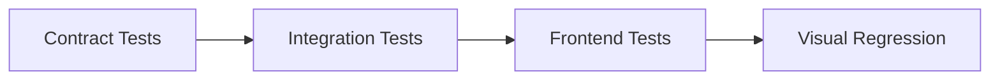

# Cermont E2E Testing Strategy — Playwright

> **Last updated:** 2026-07-04  
> **Scope:** `frontend/` (Next.js 16) + `backend/` (Express 5) + `packages/shared-types` (Zod contracts)  
> **Stack:** Playwright 1.60 | Vitest 4.x | Zod 4.x | MongoDB 7.0

---

## Table of Contents

1. [Architecture Overview](#1-architecture-overview)
2. [Project Structure](#2-project-structure)
3. [Test Classification & Execution Strategy](#3-test-classification--execution-strategy)
4. [Layer 1 — Frontend (UI) Testing](#4-layer-1--frontend-ui-testing)
5. [Layer 2 — Integration Testing](#5-layer-2--integration-testing)
6. [Layer 3 — Contract Testing](#6-layer-3--contract-testing)
7. [Page Object Model](#7-page-object-model)
8. [Fixtures & Auth](#8-fixtures--auth)
9. [CI/CD Integration](#9-cicd-integration)
10. [Code Examples](#10-code-examples)

---

## 1. Architecture Overview

```
┌─────────────────────────────────────────────────────────┐
│                    Playwright Test Runner                 │
│                                                          │
│  ┌─────────────────┐  ┌──────────────┐  ┌────────────┐ │
│  │  Layer 1: UI     │  │  Layer 2:    │  │  Layer 3:  │ │
│  │  (browser/page)  │  │  Integration │  │  Contract  │ │
│  │                  │  │  (request)   │  │  (schema)  │ │
│  └────────┬─────────┘  └──────┬───────┘  └─────┬──────┘ │
│           │                   │                 │         │
└───────────┼───────────────────┼─────────────────┼─────────┘
            │                   │                 │
            ▼                   ▼                 ▼
┌──────────────────────┐ ┌───────────────────────────────────┐
│   Next.js 16 App     │ │  Express 5 API (port 4000)         │
│   (port 3000)        │ │  /api/auth/*  /api/orders/*  ...   │
│                      │ │                                    │
│  /api/backend/* ─────┼─┼─> proxy → backend                  │
│  proxy.ts (RBAC)     │ │  Response: { success, data, error } │
└──────────────────────┘ └───────────────────────────────────┘
                                    │
                                    ▼
                            ┌───────────────┐
                            │   MongoDB     │
                            │  (test DB)    │
                            └───────────────┘
```

### Key Architectural Facts

| Component | Details |
|-----------|---------|
| **Frontend** | Next.js 16 App Router, React 19, Tailwind 4 |
| **Backend** | Express 5 on port 4000, Mongoose 9.x, Zod 4.x |
| **API Proxy** | Next.js rewrites `/api/backend/*` → `http://127.0.0.1:4000/api/*` |
| **Auth** | JWT access token (memory) + httpOnly refresh cookie |
| **Response format** | `{ success: true, data: T }` / `{ success: false, error: { code, message } }` |
| **Contracts** | 102 Zod schemas in `packages/shared-types/src/schemas/` |
| **Test DB** | `cermont_test` via `MONGODB_URI` env var |

---

## 2. Project Structure

```
frontend/
└── tests/
    └── e2e/
        ├── playwright.config.ts         # Primary Playwright config
        ├── global-setup.ts              # DB seed + auth state setup
        ├── global-teardown.ts           # DB cleanup
        ├── auth-credentials.ts          # Test user definitions
        ├── fixtures/
        │   ├── base.fixture.ts          # Custom fixtures (adminPage, apiClient, cleanup)
        │   └── api-client.fixture.ts    # E2E API client wrapper
        ├── pages/                       # Page Object Model
        │   ├── OrdersPage.ts
        │   ├── ChecklistPage.ts
        │   ├── CostPage.ts
        │   ├── ReportPage.ts
        │   └── MaintenanceCatalogPage.ts
        ├── schemas/                     # [NEW] Contract test schemas
        │   ├── api-envelope.schema.ts   # Base envelope validator
        │   └── index.ts
        ├── helpers/                     # [NEW] Test utilities
        │   ├── api-helper.ts            # Unified request helpers
        │   ├── db-helper.ts             # Direct DB helpers for test setup
        │   └── auth-helper.ts           # Token management
        ├── suites/                      # [NEW] Organized test suites
        │   ├── frontend/                # Layer 1 — UI tests
        │   ├── integration/             # Layer 2 — Integration tests
        │   └── contract/                # Layer 3 — Contract tests
        ├── 01-auth.spec.ts              # (legacy — migrate to suites/)
        ├── login.spec.ts                # (legacy)
        ├── create-order.spec.ts         # (legacy)
        ├── linked-14-step-flow.spec.ts  # (legacy — 987 lines, split into suites/)
        └── ... (36 spec files)

e2e/
└── playwright.config.ts                 # Secondary config (legacy — used by .codex/)
```

### Migration Path

The current 36 flat spec files should be reorganized into the `suites/` hierarchy:

```sh
tests/e2e/suites/
├── frontend/           # Layer 1: UI + visual tests
│   ├── auth/
│   ├── orders/
│   ├── checklists/
│   ├── dashboard/
│   ├── proposals/
│   ├── costs/
│   ├── evidences/
│   └── offline/
├── integration/        # Layer 2: API + data flow tests
│   ├── health/
│   ├── auth/
│   ├── users/
│   ├── orders/
│   ├── workflow-14-steps/
│   └── file-upload/
└── contract/           # Layer 3: Schema validation tests
    ├── envelopes/
    ├── pagination/
    ├── error-responses/
    └── module-schemas/
```

---

## 3. Test Classification & Execution Strategy

### Test Categories

| Layer | Category | Speed | Isolation | DB Required | Auth Required |
|-------|----------|-------|-----------|-------------|---------------|
| **Frontend** | UI workflow | Slow | Browser context | Yes | Yes |
| **Frontend** | Visual regression | Slow | Screenshot diff | Yes | Yes |
| **Frontend** | Accessibility | Medium | axe-core audit | Optional | Optional |
| **Integration** | API CRUD | Fast | request context | Yes | Yes |
| **Integration** | RBAC | Fast | request context | Yes | Yes |
| **Integration** | Offline/PWA | Medium | Service worker | No | No |
| **Contract** | Response shape | Fast | request context | Yes | Yes |
| **Contract** | Error codes | Fast | request context | No | Optional |
| **Contract** | Pagination | Fast | request context | Yes | Yes |

### Execution Order



Contract tests fail-fast: if API responses don't match schemas, integration and UI tests will also fail with confusing errors.

### Running Tests

```bash
# Run all E2E tests
npm run test:e2e -w frontend

# Run specific layer
npm run test:e2e -w frontend -- tests/e2e/suites/contract/
npm run test:e2e -w frontend -- tests/e2e/suites/integration/
npm run test:e2e -w frontend -- tests/e2e/suites/frontend/

# Run specific module
npm run test:e2e -w frontend -- tests/e2e/suites/integration/orders/
npm run test:e2e -w frontend -- tests/e2e/suites/frontend/auth/

# Run by test title
npm run test:e2e -w frontend -- --grep "RBAC"

# Run with UI mode
npm run test:e2e:ui -w frontend

# Run contract tests only (fast feedback)
npm run test:e2e -w frontend -- tests/e2e/suites/contract/ --project=chromium
```

---

## 4. Layer 1 — Frontend (UI) Testing

### Scope

Verify UI components render correctly, user workflows complete end-to-end, and visual integrity is maintained.

### Testing Scenarios

#### 4.1 Auth Flow
```
- Login with valid credentials → redirect to /dashboard
- Login with invalid password → show error toast
- Login with inactive user → show forbidden state
- Login → logout → redirect to /login
- Unauthenticated access → redirect to /login
- Expired token → auto-refresh → continue working
- Token refresh failure → redirect to /login
```

#### 4.2 Order Lifecycle (UI)
```
- Create order from service case context
- Order detail page loads with all sections
- Order status transitions (open → assigned → in_progress → completed → closed)
- Order kanban board renders and responds to drag-and-drop
- Order filtering by status, priority, date range
- Empty state when no orders exist
- Order not found shows 404 state
```

#### 4.3 Dashboard
```
- Dashboard loads with summary cards
- All KPI sections render (priorities, pipeline, field readiness, demand)
- Financial charts render correctly
- Maintenance efficiency section (conditional rendering)
- Loading skeleton state before data arrives
- Error state with retry button
- Empty state when no operational data
- RBAC-sensitive sections (admin-only data hidden for operador)
```

#### 4.4 14-Step Business Flow (UI)
```
Each step in the 14-step pipeline (work-request → site-visit → proposal → PO → 
planning → execution → evidence → report → delivery-record → signature → SES → 
invoice → approval → payment):

- Step creation screen renders with correct form fields
- Step detail page shows correct data from previous step
- Navigation between steps preserves context IDs
- Step-specific RBAC: only authorized roles see add/edit buttons
- Step progress indicator reflects correct current step
```

#### 4.5 Offline/PWA
```
- Offline banner appears when connectivity lost
- Queue indicator shows pending mutations
- Field execution form works without connectivity
- Reconnection triggers sync
- Conflict resolution UI appears when sync fails
```

#### 4.6 Accessibility
```typescript
// Run axe-core on each critical page
await page.goto("/orders");
await injectAxe(page);
await checkA11y(page, null, {
  includedImpacts: ["critical", "serious"],
});
```

### Visual Testing Strategy

Use Playwright's built-in screenshot comparison for critical pages:

```typescript
test("dashboard renders consistently", async ({ adminPage }) => {
  await adminPage.goto("/dashboard");
  await expect(adminPage.locator("#main-content")).toBeVisible();
  await expect(adminPage).toHaveScreenshot("dashboard-full.png", {
    maxDiffPixelRatio: 0.02,
    fullPage: true,
  });
});
```

**Approach:**
- Store baseline screenshots in `tests/e2e/fixtures/screenshots/`
- Run visual tests on a dedicated CI job
- Accept up to 2% pixel diff for anti-aliasing
- Use `--update-snapshots` to update baselines intentionally

**Pages with screenshots:**
- `/dashboard` — Main dashboard
- `/orders` — Order list
- `/orders/[id]` — Order detail
- `/login` — Login form
- `/service-cases` — Service case cockpit
- `/admin/users` — User management

---

## 5. Layer 2 — Integration Testing

### Scope

Verify seamless communication and data flow between frontend and backend through the Next.js proxy (`/api/backend/*`).

### Architecture

Tests use `playwright.request` (no browser) to hit the full stack:

```
playwright.request → http://localhost:3000/api/backend/* → Next.js rewrites → http://localhost:4000/api/* → Express routes → MongoDB
```

### Testing Scenarios

#### 5.1 Health & Connectivity
```
- GET /api/health/live → 200 { status: "ok", check: "liveness" }
- GET /api/health/ready → 200 (MongoDB connected) or 503 (not ready)
```

#### 5.2 Auth API
```
- POST /auth/login (valid) → 200 + accessToken
- POST /auth/login (wrong password) → 401 + error code
- POST /auth/login (unknown email) → 401
- POST /auth/login (empty fields) → 400 + validation error
- GET protected route (no auth) → 401 + UNAUTHORIZED error
- GET protected route (malformed token) → 401
- POST /auth/refresh (valid cookie) → 200 + new token
- POST /auth/refresh (no cookie) → 401
```

#### 5.3 CRUD Operations
```
For each core resource (users, orders, checklists, kits, proposals, costs, reports):

- POST creates resource → 201 + data with _id
- GET list returns paginated → 200 + data[] + pagination meta
- GET :id returns single → 200 + full resource
- PATCH :id updates fields → 200 + updated data
- DELETE :id removes resource → 200 or 204
- GET :id (non-existent) → 404
- POST with invalid body → 400 + validation error details
```

#### 5.4 RBAC Enforcement
```
Test every protected endpoint with each role:

- gerente:    full access (CRUD all resources)
- residente:  order management, resource assignment
- supervisor: execution validation, checklist approval
- operador:   field execution, evidence upload
- tecnico:    technical reports, inspections
- cliente:    read-only portal access

Unauthorized role → 403 FORBIDDEN
```

#### 5.5 14-Step Workflow Integration
```
Full serial workflow:

1. POST /work-requests → serviceCaseId
2. POST /site-visits → siteVisitId (linked to serviceCaseId)
3. POST /proposals → proposalId
4. POST /proposals/{id}/po → creates order
5. POST /planning-packets → planningPacketId
6. POST /execution-sessions → sessionId
7. POST /evidences → evidenceId
8. POST /technical-reports → reportId
9. POST /delivery-records → recordId
10. POST /signatures → signatureId
11. POST /service-entry-sheets → sesId
12. POST /invoices → invoiceId
13. PATCH /invoices/{id}/approve → invoice approved
14. POST /payments → paymentId

Each step validates that IDs from previous steps propagate correctly
and that the service case status transitions are reflected in the
cockpit read-model (GET /service-cases/{id}/workflow).
```

#### 5.6 File Upload
```
- POST /files/upload (valid image) → 200 + file metadata
- POST /files/upload (invalid type) → 415 UNSUPPORTED_MEDIA_TYPE
- POST /files/upload (too large) → 413 PAYLOAD_TOO_LARGE
- GET /files/{id}/content → 200 + binary content
- Evidence attached to order → visible in GET /orders/{id}
```

#### 5.7 Offline Sync
```
- POST offline mutation → stored in queue
- POST /offline-sync (replay queue) → synced to backend
- Concurrent sync with same clientMutationId → idempotent
- Sync with stale data → conflict resolution response
```

---

## 6. Layer 3 — Contract Testing

### Scope

Validate that every API response strictly adheres to its Zod schema. This is the **fastest feedback layer** — run first to catch schema regressions.

### Architecture

Use Playwright's `request` API to hit endpoints, then validate responses against Zod schemas from `@cermont/shared-types`.

```typescript
import { createOrderSchema, Order } from "@cermont/shared-types";

// Validates shape at runtime
const parsed = OrderSchema.safeParse(responseData);
expect(parsed.success).toBe(true);
```

### Standard Envelope Schemas

```typescript
// packages/shared-types/src/schemas/api-envelope.schema.ts
import { z } from "zod";

// ── Success Envelope ──────────────────────────────────────
export const ApiSuccessEnvelopeSchema = <T extends z.ZodTypeAny>(dataSchema: T) =>
  z.object({
    success: z.literal(true),
    data: dataSchema,
  });

// ── Paginated Envelope ────────────────────────────────────
export const PaginationMetaSchema = z.object({
  total: z.number().int().nonnegative(),
  page: z.number().int().min(1),
  totalPages: z.number().int().min(0),
  limit: z.number().int().min(1),
});

export const ApiPaginatedEnvelopeSchema = <T extends z.ZodTypeAny>(dataSchema: T) =>
  z.object({
    success: z.literal(true),
    data: z.array(dataSchema),
    pagination: PaginationMetaSchema,
  });

// ── Error Envelope ────────────────────────────────────────
export const ApiErrorEnvelopeSchema = z.object({
  success: z.literal(false),
  error: z.object({
    code: z.string(),
    message: z.string(),
    details: z.unknown().optional(),
  }),
});
```

### Contract Test Patterns

#### 6.1 Envelope Validation

Every response must match one of the three envelope shapes:

```typescript
test("POST /auth/login returns success envelope", async () => {
  const resp = await apiPost("/auth/login", {
    email: E2E_ADMIN.email,
    password: E2E_ADMIN.password,
  });
  expect(resp.status).toBe(200);

  const parsed = ApiSuccessEnvelopeSchema(
    z.object({ accessToken: z.string() })
  ).safeParse(resp.body);
  expect(parsed.success).toBe(true);
});
```

#### 6.2 Resource Schema Validation

```typescript
test("GET /orders returns orders matching OrderSchema", async () => {
  const { status, body } = await apiGet(adminToken, "/orders?limit=5");
  expect(status).toBe(200);

  const parsed = ApiPaginatedEnvelopeSchema(z.array(OrderSchema)).safeParse(body);
  expect(parsed.success).toBe(true);

  if (parsed.success && parsed.data.data.length > 0) {
    for (const order of parsed.data.data) {
      expect(order._id).toMatch(/^[0-9a-f]{24}$/);
      expect(ORDER_STATUS_VALUES).toContain(order.status);
    }
  }
});
```

#### 6.3 Error Contract Validation

```typescript
test("POST /orders without auth returns 401 with error envelope", async () => {
  const resp = await rawPost("/orders", {});
  expect(resp.status()).toBe(401);

  const parsed = ApiErrorEnvelopeSchema.safeParse(await resp.json());
  expect(parsed.success).toBe(true);
  expect(parsed.data?.error.code).toBe("UNAUTHORIZED");
});

test("POST /orders with invalid body returns 400 with validation error", async () => {
  const { status, body } = await apiPost(adminToken, "/orders", { invalid: true });
  expect(status).toBe(400);

  const parsed = ApiErrorEnvelopeSchema.safeParse(body);
  expect(parsed.success).toBe(true);
  expect(["VALIDATION_FAILED", "BAD_REQUEST"]).toContain(parsed.data?.error.code);
});
```

#### 6.4 Schema Registry

Maintain a map of endpoint → Zod schema for automated contract checks:

```typescript
// tests/e2e/schemas/registry.ts
import {
  OrderSchema, UserSchema, ChecklistSchema, ProposalSchema,
  CostResponseSchema, WorkReportSchema, EvidenceSchema,
  DeliveryRecordSchema, ServiceEntrySheetSchema, InvoiceSchema,
  PaymentSchema,
} from "@cermont/shared-types";
import type { ZodSchema } from "zod";

interface ContractEntry {
  path: string;
  method: "GET" | "POST" | "PATCH" | "DELETE";
  /** Schema for the `data` field when success=true */
  dataSchema?: ZodSchema;
  /** Schema for each item when data is an array */
  itemSchema?: ZodSchema;
  /** Expected status codes */
  successStatus: number[];
}

export const CONTRACT_REGISTRY: ContractEntry[] = [
  { path: "/users", method: "GET", itemSchema: UserSchema, successStatus: [200] },
  { path: "/users/:id", method: "GET", dataSchema: UserSchema, successStatus: [200] },
  { path: "/orders", method: "GET", itemSchema: OrderSchema, successStatus: [200] },
  { path: "/orders/:id", method: "GET", dataSchema: OrderSchema, successStatus: [200] },
  { path: "/checklists/order/:id", method: "GET", itemSchema: ChecklistSchema, successStatus: [200] },
  { path: "/proposals", method: "GET", itemSchema: ProposalSchema, successStatus: [200] },
  { path: "/costs/summary/:orderId", method: "GET", dataSchema: CostResponseSchema, successStatus: [200] },
  { path: "/reports", method: "GET", itemSchema: WorkReportSchema, successStatus: [200] },
  { path: "/evidences", method: "GET", itemSchema: EvidenceSchema, successStatus: [200] },
  { path: "/delivery-records", method: "GET", itemSchema: DeliveryRecordSchema, successStatus: [200] },
  { path: "/service-entry-sheets", method: "GET", itemSchema: ServiceEntrySheetSchema, successStatus: [200] },
  { path: "/invoices", method: "GET", itemSchema: InvoiceSchema, successStatus: [200] },
  { path: "/payments", method: "GET", itemSchema: PaymentSchema, successStatus: [200] },
  // CRUD creation endpoints
  { path: "/users", method: "POST", dataSchema: UserSchema, successStatus: [201] },
  { path: "/orders", method: "POST", dataSchema: OrderSchema, successStatus: [201] },
];

export function resolvePath(entry: ContractEntry, params?: Record<string, string>): string {
  let path = entry.path;
  if (params) {
    for (const [key, value] of Object.entries(params)) {
      path = path.replace(`:${key}`, encodeURIComponent(value));
    }
  }
  return path;
}
```

#### 6.5 Automated Contract Audit

A generator-based test that iterates the registry:

```typescript
// tests/e2e/suites/contract/envelopes/envelope-contract.spec.ts
import { test, expect } from "@playwright/test";
import { CONTRACT_REGISTRY, resolvePath } from "../../../schemas/registry";
import { ApiSuccessEnvelopeSchema, ApiPaginatedEnvelopeSchema } from "../../../schemas/api-envelope.schema";
import { E2E_ADMIN } from "../../../auth-credentials";
import { apiGet, loginAs } from "../../../helpers/api-helper";

let adminToken: string;

test.beforeAll(async () => {
  adminToken = await loginAs(E2E_ADMIN.email, E2E_ADMIN.password);
});

for (const entry of CONTRACT_REGISTRY) {
  test(`[Contract] ${entry.method} ${entry.path} returns correct envelope`, async () => {
    const { status, body } = await apiGet(adminToken, resolvePath(entry, {
      id: "aaaaaaaaaaaaaaaaaaaaaaa1",
      orderId: "aaaaaaaaaaaaaaaaaaaaaaa1",
    }));

    expect(entry.successStatus).toContain(status);

    if (entry.itemSchema) {
      // Paginated response
      const parsed = ApiPaginatedEnvelopeSchema(entry.itemSchema).safeParse(body);
      expect(parsed.success).toBe(true);
    } else if (entry.dataSchema) {
      // Single response
      const parsed = ApiSuccessEnvelopeSchema(entry.dataSchema).safeParse(body);
      expect(parsed.success).toBe(true);
    }
  });
}
```

---

## 7. Page Object Model

### Existing Pages

| Class | File | Responsibilities |
|-------|------|------------------|
| `OrdersPage` | `pages/OrdersPage.ts` | Order CRUD, form fill, submit, status checks |
| `ChecklistPage` | `pages/ChecklistPage.ts` | Checklist tab, item status, completion |
| `CostPage` | `pages/CostPage.ts` | Cost entry, summary view |
| `ReportPage` | `pages/ReportPage.ts` | Report creation, approval |
| `MaintenanceCatalogPage` | `pages/MaintenanceCatalogPage.ts` | Kit management |

### POM Guidelines

Each Page Object must follow this structure:

```typescript
export class ExamplePage {
  constructor(public readonly page: Page) {}

  // ── Locators (public readonly) ───────────────────────────
  readonly heading = this.page.getByRole("heading", { name: /page title/i });
  readonly submitButton = this.page.getByRole("button", { name: /guardar/i });
  readonly errorToast = this.page.getByRole("alert").filter({ hasText: /error/i });

  // ── Navigation ───────────────────────────────────────────
  async goto(params?: Record<string, string>): Promise<void> {
    const search = params ? `?${new URLSearchParams(params)}` : "";
    await this.page.goto(`/example${search}`);
  }

  // ── Actions ──────────────────────────────────────────────
  async fillForm(data: ExampleFormData): Promise<void> {
    await this.page.getByLabel("Campo 1").fill(data.field1);
    await this.page.getByLabel("Campo 2").fill(data.field2);
  }

  async submit(): Promise<ApiResponse> {
    const responsePromise = this.page.waitForResponse(
      (res) => res.url().includes("/api/backend/example") && res.request().method() === "POST",
    );
    await this.submitButton.click();
    return responsePromise.then((r) => r.json() as Promise<ApiResponse>);
  }

  // ── Assertions ───────────────────────────────────────────
  async expectLoaded(): Promise<void> {
    await expect(this.heading).toBeVisible();
  }

  async expectFieldError(fieldLabel: string, message: string): Promise<void> {
    await expect(
      this.page.getByLabel(fieldLabel).locator("..").getByText(message),
    ).toBeVisible();
  }
}
```

### Required New Pages

| Page Class | Module | Priority |
|-----------|--------|----------|
| `LoginPage` | Auth | P0 |
| `DashboardPage` | Dashboard | P0 |
| `ProposalPage` | Proposals | P1 |
| `EvidencePage` | Evidences | P1 |
| `InvoicePage` | Invoices | P1 |
| `ServiceCasePage` | Service Cases | P1 |
| `UserAdminPage` | Admin/Users | P1 |
| `SiteVisitPage` | Site Visits | P2 |
| `DeliveryRecordPage` | Delivery Records | P2 |
| `PaymentPage` | Payments | P2 |
| `ExecutionPage` | Field Execution | P2 |

---

## 8. Fixtures & Auth

### Custom Fixtures (existing)

```typescript
// tests/e2e/fixtures/base.fixture.ts
export const test = base.extend<{
  adminPage: Page;        // Authenticated as gerente
  supervisorPage: Page;   // Authenticated as supervisor
  technicianPage: Page;   // Authenticated as tecnico
  apiClient: E2EApiClient; // Direct API client (port 4000)
  cleanup: Cleanup;       // Track & delete created resources
}>({ ... });
```

### Authentication Strategy

```
global-setup.ts
├── Drop test DB (cermont_test + fallback cermont)
├── Seed 3 users (admin, supervisor, technician)
├── Login each user via POST /auth/login
├── Save Playwright storageState to tests/e2e/fixtures/.auth/
│   ├── admin.json
│   ├── supervisor.json
│   └── technician.json
└── Persist credentials to seed-data.json

base.fixture.ts
├── Load storageState files
├── Create isolated browser context per role
└── Expose as adminPage, supervisorPage, technicianPage
```

### API Helper (recommended enhancement)

```typescript
// tests/e2e/helpers/api-helper.ts
import { request, type APIRequestContext } from "@playwright/test";

const BASE_URL = process.env.TEST_BASE_URL ?? "http://localhost:3000";

export async function createAuthedContext(token: string): Promise<APIRequestContext> {
  return request.newContext({
    baseURL: BASE_URL,
    extraHTTPHeaders: {
      Authorization: `Bearer ${token}`,
      "Content-Type": "application/json",
    },
  });
}

export async function loginAs(
  email: string,
  password: string,
): Promise<string> {
  const ctx = await request.newContext({ baseURL: BASE_URL });
  try {
    const resp = await ctx.post("/api/backend/auth/login", {
      data: { email, password },
    });
    const body = (await resp.json()) as { data?: { accessToken?: string } };
    return body.data?.accessToken ?? "";
  } finally {
    await ctx.dispose();
  }
}

export async function apiGet<T>(
  token: string,
  path: string,
): Promise<{ status: number; body: T }> {
  const ctx = await createAuthedContext(token);
  try {
    const resp = await ctx.get(`/api/backend${path}`);
    return { status: resp.status(), body: (await resp.json()) as T };
  } finally {
    await ctx.dispose();
  }
}

export async function apiPost<T>(
  token: string,
  path: string,
  data: object,
): Promise<{ status: number; body: T }> {
  const ctx = await createAuthedContext(token);
  try {
    const resp = await ctx.post(`/api/backend${path}`, { data });
    return { status: resp.status(), body: (await resp.json()) as T };
  } finally {
    await ctx.dispose();
  }
}
```

---

## 9. CI/CD Integration

### Pipeline Stages

```yaml
# .github/workflows/e2e.yml
name: E2E Tests
on:
  push:
    branches: [main, deploy/*]
  pull_request:
    branches: [main]

jobs:
  contract:
    name: Contract Tests
    runs-on: ubuntu-latest
    services:
      mongodb:
        image: mongo:7
        ports: ["27017:27017"]
    steps:
      - uses: actions/checkout@v4
      - uses: actions/setup-node@v4
        with: { node-version: "22" }
      - run: npm ci
      - run: npm run build -w @cermont/shared-types
      - run: npx playwright install --with-deps chromium
      - run: npm run test:e2e -w frontend -- tests/e2e/suites/contract/
        env:
          MONGODB_URI: mongodb://127.0.0.1:27017/cermont_test
          TEST_BASE_URL: http://localhost:3000

  integration:
    name: Integration Tests
    needs: contract
    runs-on: ubuntu-latest
    services:
      mongodb:
        image: mongo:7
        ports: ["27017:27017"]
    steps:
      - uses: actions/checkout@v4
      - uses: actions/setup-node@v4
        with: { node-version: "22" }
      - run: npm ci
      - run: npx playwright install --with-deps chromium
      - run: npm run test:e2e -w frontend -- tests/e2e/suites/integration/
        env:
          MONGODB_URI: mongodb://127.0.0.1:27017/cermont_test
          TEST_BASE_URL: http://localhost:3000

  e2e:
    name: E2E UI Tests
    needs: integration
    runs-on: ubuntu-latest
    services:
      mongodb:
        image: mongo:7
        ports: ["27017:27017"]
    steps:
      - uses: actions/checkout@v4
      - uses: actions/setup-node@v4
        with: { node-version: "22" }
      - run: npm ci
      - run: npx playwright install --with-deps chromium
      - run: npm run test:e2e -w frontend -- tests/e2e/suites/frontend/
        env:
          MONGODB_URI: mongodb://127.0.0.1:27017/cermont_test
          TEST_BASE_URL: http://localhost:3000
      - uses: actions/upload-artifact@v4
        if: failure()
        with:
          name: playwright-report
          path: frontend/playwright-report/
```

### Quality Gates

| Gate | Command | When | Fail behavior |
|------|---------|------|---------------|
| Contract | `npm run test:e2e -w frontend -- suites/contract/` | Every PR | Block merge |
| Integration | `npm run test:e2e -w frontend -- suites/integration/` | Every PR | Block merge |
| E2E UI | `npm run test:e2e -w frontend -- suites/frontend/` | Every PR | Warning (flaky) |
| Visual | `npm run test:e2e -w frontend -- -g "screenshot"` | Release | Block release |

### Test Reporting

```typescript
// playwright.config.ts — reporter configuration
reporter: [
  ["html", { open: "never", outputFolder: "playwright-report" }],
  ["json", { outputFile: "test-results/e2e-report.json" }],
  ["junit", { outputFile: "test-results/e2e-junit.xml" }],
  ["list"],
],
```

---

## 10. Code Examples

### 10.1 Full Integration Test: Order CRUD

```typescript
// tests/e2e/suites/integration/orders/order-crud.spec.ts
import { expect, test } from "@playwright/test";
import { E2E_ADMIN, E2E_SUPERVISOR, E2E_KIT } from "../../../auth-credentials";
import { loginAs, apiGet, apiPost, apiPatch } from "../../../helpers/api-helper";
import {
  OrderSchema,
  ApiSuccessEnvelopeSchema,
  ApiPaginatedEnvelopeSchema,
  ApiErrorEnvelopeSchema,
} from "../../../schemas";

test.describe("Orders — CRUD + RBAC", () => {
  let adminToken: string;
  let supervisorToken: string;
  let createdOrderId: string;

  test.beforeAll(async () => {
    adminToken = await loginAs(E2E_ADMIN.email, E2E_ADMIN.password);
    supervisorToken = await loginAs(E2E_SUPERVISOR.email, E2E_SUPERVISOR.password);
  });

  test("POST /orders creates a new order (201)", async () => {
    const unique = Date.now().toString(36);
    const { status, body } = await apiPost(adminToken, "/orders", {
      type: "maintenance",
      priority: "medium",
      description: `E2E Order ${unique}`,
      location: "Planta Norte",
    });

    expect(status).toBe(201);

    // Contract check: response matches success envelope with OrderSchema
    const parsed = ApiSuccessEnvelopeSchema(OrderSchema).safeParse(body);
    expect(parsed.success).toBe(true);

    createdOrderId = parsed.data!.data._id;
    expect(createdOrderId).toMatch(/^[0-9a-f]{24}$/);
  });

  test("GET /orders returns paginated list", async () => {
    const { status, body } = await apiGet(adminToken, "/orders?limit=10");
    expect(status).toBe(200);

    const parsed = ApiPaginatedEnvelopeSchema(OrderSchema).safeParse(body);
    expect(parsed.success).toBe(true);
    expect(parsed.data!.pagination.limit).toBe(10);
  });

  test("GET /orders/:id returns single order", async () => {
    const { status, body } = await apiGet(adminToken, `/orders/${createdOrderId}`);
    expect(status).toBe(200);

    const parsed = ApiSuccessEnvelopeSchema(OrderSchema).safeParse(body);
    expect(parsed.success).toBe(true);
    expect(parsed.data!.data._id).toBe(createdOrderId);
  });

  test("PATCH /orders/:id/status transitions status", async () => {
    const { status, body } = await apiPatch(adminToken, `/orders/${createdOrderId}/status`, {
      status: "assigned",
    });
    expect(status).toBe(200);

    const parsed = ApiSuccessEnvelopeSchema(OrderSchema).safeParse(body);
    expect(parsed.success).toBe(true);
    expect(parsed.data!.data.status).toBe("assigned");
  });

  test("GET /orders/:id (non-existent) returns 404", async () => {
    const fakeId = "aaaaaaaaaaaaaaaaaaaaaaa1";
    const { status, body } = await apiGet(adminToken, `/orders/${fakeId}`);

    expect(status).toBe(404);

    const parsed = ApiErrorEnvelopeSchema.safeParse(body);
    expect(parsed.success).toBe(true);
    expect(parsed.data!.error.code).toBe("NOT_FOUND");
  });

  test("POST /orders without auth returns 401", async () => {
    const { status } = await apiPost("invalid-token", "/orders", {});
    expect(status).toBe(401);
  });

  test("POST /orders as supervisor succeeds (authorized)", async () => {
    const { status } = await apiPost(supervisorToken, "/orders", {
      type: "maintenance",
      priority: "low",
      description: `Supervisor order ${Date.now().toString(36)}`,
    });
    expect(status).toBe(201);
  });
});
```

### 10.2 Full UI Test: Login + Dashboard

```typescript
// tests/e2e/suites/frontend/auth/login-flow.spec.ts
import { expect, test } from "../../../fixtures/base.fixture";

test.describe("Login Flow", () => {
  test("redirects unauthenticated users to /login", async ({ page }) => {
    await page.goto("/dashboard");
    await expect(page).toHaveURL(/\/login/);
  });

  test("shows validation errors on empty form", async ({ page }) => {
    await page.goto("/login");
    await page.getByRole("button", { name: /iniciar sesión/i }).click();

    await expect(page.getByText(/correo electrónico es requerido/i)).toBeVisible();
  });

  test("login with invalid credentials shows error toast", async ({ page }) => {
    await page.goto("/login");
    await page.getByLabel("Correo electrónico").fill("admin@cermont.test");
    await page.getByLabel("Contraseña").fill("wrongpassword");
    await page.getByRole("button", { name: /iniciar sesión/i }).click();

    await expect(page.getByRole("alert")).toContainText(/credenciales inválidas/i);
  });
});

test.describe("Dashboard", () => {
  test("dashboard shows all priority cards", async ({ adminPage }) => {
    await adminPage.goto("/dashboard");

    // Priority section
    await expect(adminPage.getByText("Controles críticos por resolver")).toBeVisible();
    await expect(adminPage.getByText("Evidencias por validar")).toBeVisible();
    await expect(adminPage.getByText("Expedientes por cerrar")).toBeVisible();
    await expect(adminPage.getByText("Cartera vencida")).toBeVisible();

    // Pipeline section
    await expect(adminPage.getByText("Flujo documental")).toBeVisible();

    // Field readiness section
    await expect(adminPage.getByText("Preparación de campo")).toBeVisible();

    // Service demand section
    await expect(adminPage.getByText("Demanda de servicios")).toBeVisible();
  });

  test("dashboard loading state shows skeleton", async ({ adminPage }) => {
    // Mock slow API
    await adminPage.route("**/api/backend/dashboard/summary", async (route) => {
      await new Promise((r) => setTimeout(r, 5000));
      await route.continue();
    });

    await adminPage.goto("/dashboard");
    await expect(adminPage.getByRole("status")).toBeVisible();
  });
});
```

### 10.3 Contract Test: Automated Registry Scan

```typescript
// tests/e2e/suites/contract/envelopes/registry-scan.spec.ts
import { expect, test } from "@playwright/test";
import { E2E_ADMIN } from "../../../auth-credentials";
import { loginAs } from "../../../helpers/api-helper";
import { CONTRACT_REGISTRY, resolvePath } from "../../../schemas/registry";
import {
  ApiSuccessEnvelopeSchema,
  ApiPaginatedEnvelopeSchema,
  ApiErrorEnvelopeSchema,
} from "../../../schemas/api-envelope.schema";
import { z } from "zod";

test.describe("Contract Registry — Automated Schema Audit", () => {
  let token: string;

  test.beforeAll(async () => {
    token = await loginAs(E2E_ADMIN.email, E2E_ADMIN.password);
  });

  for (const entry of CONTRACT_REGISTRY) {
    test(`${entry.method} ${entry.path} — envelope + data schema`, async ({ request }) => {
      const path = resolvePath(entry, {
        id: "aaaaaaaaaaaaaaaaaaaaaaa1",
        orderId: "aaaaaaaaaaaaaaaaaaaaaaa1",
      });

      const resp = await request.get(`/api/backend${path}`, {
        headers: { Authorization: `Bearer ${token}` },
      });
      const body = await resp.json();

      // Must be one of the valid statuses
      expect(entry.successStatus).toContain(resp.status());

      // Validate envelope + data schema
      if (entry.itemSchema) {
        const parsed = ApiPaginatedEnvelopeSchema(entry.itemSchema).safeParse(body);
        if (!parsed.success) {
          console.error(`Schema mismatch for ${entry.method} ${entry.path}:`, parsed.error.issues);
        }
        expect(parsed.success).toBe(true);
      } else if (entry.dataSchema) {
        const parsed = ApiSuccessEnvelopeSchema(entry.dataSchema).safeParse(body);
        if (!parsed.success) {
          console.error(`Schema mismatch for ${entry.method} ${entry.path}:`, parsed.error.issues);
        }
        expect(parsed.success).toBe(true);
      }

      // Verify pagination shape if paginated
      if (body.pagination) {
        const paginationParsed = z.object({
          total: z.number().int().nonnegative(),
          page: z.number().int().min(1),
          totalPages: z.number().int().min(0),
          limit: z.number().int().min(1),
        }).safeParse(body.pagination);
        expect(paginationParsed.success).toBe(true);
      }
    });
  }

  test("error responses always match error envelope", async ({ request }) => {
    // Test various error scenarios across the API
    const errorScenarios = [
      { path: "/users", method: "GET" as const },             // no auth
      { path: "/orders/-1", method: "GET" as const },          // invalid ID
      { path: "/orders", method: "POST" as const, data: {} },  // empty body
    ];

    for (const scenario of errorScenarios) {
      const resp = await request.get(`/api/backend${scenario.path}`, {});
      const body = await resp.json().catch(() => ({}));

      const parsed = ApiErrorEnvelopeSchema.safeParse(body);
      expect(parsed.success).toBe(true);
      expect(typeof parsed.data?.error.code).toBe("string");
      expect(typeof parsed.data?.error.message).toBe("string");
    }
  });
});
```

### 10.4 Full UI Workflow: 14-Step Flow (Frontend)

```typescript
// tests/e2e/suites/frontend/workflow/fourteen-step-flow.spec.ts
import { expect, test } from "../../../fixtures/base.fixture";
import { E2E_KIT } from "../../../auth-credentials";

test.describe("14-Step Business Flow — UI Walkthrough", () => {
  test.describe.configure({ mode: "serial" });

  test("creates a work request and navigates to cockpit", async ({ adminPage, apiClient }) => {
    await adminPage.goto("/work-requests/new");

    // Fill work request form
    await adminPage.getByLabel("Nombre del solicitante").fill("E2E Tester");
    await adminPage.getByLabel("Cliente").fill("Cliente E2E");
    await adminPage.getByLabel("Sitio").fill("Planta Norte");
    await adminPage.getByLabel("Tipo de servicio").selectOption("correctivo");
    await adminPage.getByLabel("Descripción").fill(`E2E Work Request ${Date.now()}`);

    // Submit
    const responsePromise = adminPage.waitForResponse(
      (r) => r.url().includes("/work-requests") && r.request().method() === "POST",
    );
    await adminPage.getByRole("button", { name: /crear solicitud/i }).click();
    const response = await responsePromise;
    expect(response.ok()).toBe(true);

    // Verify redirect to service case cockpit
    await expect(adminPage).toHaveURL(/\/service-cases\//);
    await expect(adminPage.getByText("Solicitud de trabajo")).toBeVisible();
  });

  test("advances through all 14 steps in the UI", async ({ adminPage, apiClient }) => {
    // Each step: navigate to step creation, fill form, submit, verify next step available
    // This test uses the API client for data setup and the browser for UI verification

    const steps = [
      { name: "Visita técnica", route: "/site-visits/new", button: /crear visita/i },
      { name: "Propuesta", route: "/proposals/new", button: /crear propuesta/i },
      { name: "Orden de compra", route: "/purchase-orders/new", button: /adjuntar po/i },
      // ... remaining 11 steps
    ];

    for (const step of steps) {
      await adminPage.goto(step.route);
      await expect(adminPage.getByRole("button", { name: step.button })).toBeVisible();
    }
  });
});
```

### 10.5 Visual Testing

```typescript
// tests/e2e/suites/frontend/visual/dashboard-visual.spec.ts
import { expect, test } from "../../../fixtures/base.fixture";

test.describe("Dashboard — Visual Regression", () => {
  test("dashboard matches baseline screenshot", async ({ adminPage }) => {
    await adminPage.goto("/dashboard");
    await expect(adminPage.locator("#main-content")).toBeVisible();

    // Wait for all charts to render
    await expect(adminPage.locator(".recharts-wrapper").first()).toBeVisible();

    await expect(adminPage).toHaveScreenshot("dashboard-full.png", {
      fullPage: true,
      maxDiffPixelRatio: 0.02,
      animations: "disabled",
    });
  });

  test("login page matches baseline", async ({ page }) => {
    await page.goto("/login");
    await expect(page.locator("form")).toBeVisible();
    await expect(page).toHaveScreenshot("login-page.png", {
      maxDiffPixelRatio: 0.01,
    });
  });
});
```

### 10.6 Accessibility Audit

```typescript
// tests/e2e/suites/frontend/a11y/critical-pages.spec.ts
import { injectAxe, checkA11y } from "axe-playwright";
import { expect, test } from "../../../fixtures/base.fixture";

const CRITICAL_PAGES = [
  { path: "/login", name: "login" },
  { path: "/dashboard", name: "dashboard", auth: "adminPage" },
  { path: "/orders", name: "orders list", auth: "adminPage" },
  { path: "/orders/new", name: "new order", auth: "adminPage" },
  { path: "/service-cases", name: "service cases", auth: "adminPage" },
] as const;

for (const pageConfig of CRITICAL_PAGES) {
  test(`${pageConfig.name} has no critical a11y violations`, async ({ page, adminPage }) => {
    const activePage = pageConfig.auth ? adminPage : page;
    await activePage.goto(pageConfig.path);
    await activePage.waitForLoadState("networkidle");

    await injectAxe(activePage);
    const results = await checkA11y(activePage, null, {
      includedImpacts: ["critical", "serious"],
    });

    expect(results.violations).toEqual([]);
  });
}
```

---

## Implementation Roadmap

| Phase | What | Effort | Depends On |
|-------|------|--------|------------|
| **P0** | Create `schemas/` directory with envelope schemas + registry | 1 day | — |
| **P0** | Create `helpers/api-helper.ts` with unified helpers | 0.5 day | — |
| **P0** | Contract suite for all GET endpoints in registry | 2 days | Schema registry |
| **P1** | Migrate 36 legacy spec files into `suites/` hierarchy | 2 days | API helpers |
| **P1** | Contract suite for POST/PATCH/DELETE endpoints | 1 day | Schema registry |
| **P1** | Integration suite for 14-step workflow | 3 days | API helpers |
| **P1** | Add `LoginPage`, `DashboardPage`, `ServiceCasePage` POMs | 1 day | — |
| **P2** | Visual regression screenshots for critical pages | 1 day | POMs |
| **P2** | Accessibility audit suite with axe-core | 1 day | POMs |
| **P2** | RBAC matrix test (all roles × all endpoints) | 2 days | API helpers |
| **P3** | CI/CD pipeline with layer gating | 1 day | All suites |
| **P3** | Offline-sync integration tests | 2 days | API helpers |

---

## Appendix: Existing Test Inventory

| File | Lines | Layer | Coverage |
|------|-------|-------|----------|
| `01-auth.spec.ts` | 22 | Frontend | Login/logout UI |
| `03-rbac.spec.ts` | — | Integration | Role-based access |
| `auth.spec.ts` | — | Integration | Auth API |
| `login.spec.ts` | — | Frontend | Login form |
| `create-order.spec.ts` | 28 | Frontend | Order creation |
| `business-flow-14-steps.spec.ts` | 121 | Integration | 14-step pipeline API |
| `linked-14-step-flow.spec.ts` | 987 | Integration | Deep 14-step serial |
| `critical-workflows.spec.ts` | — | Frontend | Critical paths |
| `comprehensive/api-e2e.spec.ts` | 694 | Integration | Full API CRUD + RBAC |
| `comprehensive/full-app-smoke-e2e.spec.ts` | — | Frontend | App smoke test |
| `smoke/f01-create-order-and-checklist.spec.ts` | 46 | Frontend | POM: order + checklist |
| `smoke/f02-complete-checklist.spec.ts` | — | Frontend | POM: checklist |
| `smoke/f03-register-costs.spec.ts` | — | Frontend | POM: costs |
| `smoke/f04-generate-and-approve-report.spec.ts` | — | Frontend | POM: reports |
| `smoke/f05-ready-for-invoicing-gates.spec.ts` | — | Frontend | POM: invoicing |
| `smoke/f06-edit-kit-and-propagate.spec.ts` | — | Frontend | POM: kits |
| `offline.spec.ts` | — | Integration | Offline mode |
| `offline-first.spec.ts` | — | Integration | Offline-first sync |
| `offline-pwa.spec.ts` | — | Integration | PWA behavior |
| `offline-critical-mutations.spec.ts` | — | Integration | Critical offline ops |
| `evidence-flow.spec.ts` | — | Frontend | Evidence upload |
| `file-upload.spec.ts` | — | Integration | File upload API |
| `file-upload-outbox.spec.ts` | — | Integration | Outbox pattern |
| `proposals.spec.ts` | — | Frontend | Proposal flow |
| `invoices.spec.ts` | — | Frontend | Invoice flow |
| `payments.spec.ts` | — | Frontend | Payment flow |
| `service-entry-sheets.spec.ts` | — | Frontend | SES flow |
| `admin-closure.spec.ts` | — | Frontend | Admin closure |
| `documents-smoke.spec.ts` | — | Frontend | Document ingestion |
| `deploy-readiness.spec.ts` | — | Integration | Deploy health checks |
| `page-smoke.spec.ts` | — | Frontend | Page response smoke |
| `spec-008-009-smoke.spec.ts` | — | Frontend | Regression smoke |
| `auth-sw-idb-regression.spec.ts` | — | Integration | Auth + SW + IndexedDB |
| `post-hallazgos-continuidad.spec.ts` | — | Integration | Continuity fixes |
| `comprehensive/input-validation-e2e.spec.ts` | — | Integration | Validation edge cases |
